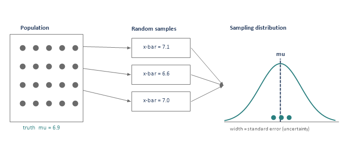
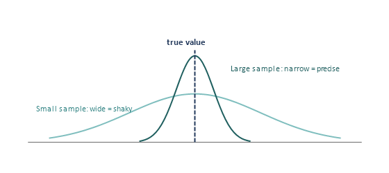
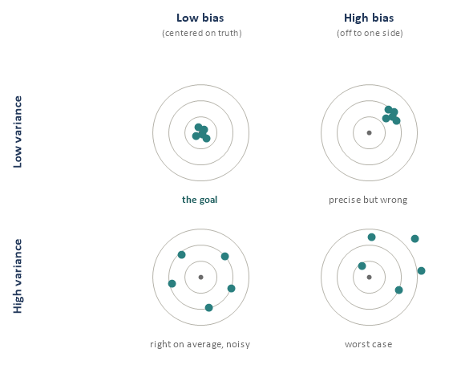
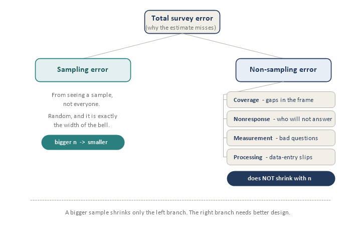
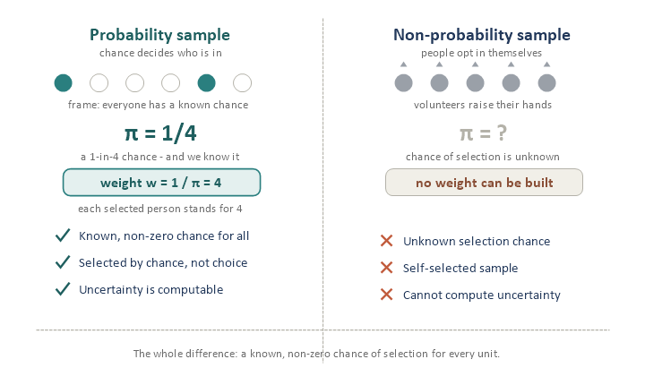
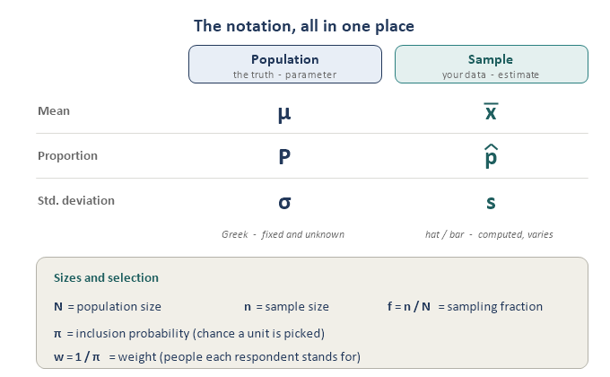

Everything else in sampling is built on one picture: **one population, then many possible samples, then a bell-shaped pile of estimates centered on the truth.** Take that one idea slowly and the rest is just careful bookkeeping on top of it.

## Why sample at all?

You want to know something about a big group, but measuring **everyone** is too expensive, too slow, or impossible. So you look at a **slice** and use it to make a good guess about the whole. Three everyday examples are all the same move:

- **A blood test.** The lab does not drain all your blood; one small vial tells them about your entire body, because blood is well mixed.
- **Tasting rice or soup.** One grain (well stirred in) tells you whether the whole pot is cooked or needs salt.
- **An exit poll.** Ask a few thousand voters and forecast an election of millions.

In every case a small, fair slice stands in for the whole. The opposite of sampling is a **census** (measuring everyone, like the U.S. Census) — sometimes worth it, but usually far too costly and slow, which is exactly why sampling exists.

## The core vocabulary

Running example: we want the **average hours of sleep** for all 50,000 students at a university (and, in parallel, a pot of rice).

- **Population** - the whole group you care about (all 50,000 students; all the rice in the pot).
- **Element / unit** - one member of it (one student; one grain).
- **Frame** - the actual list you draw from (the registrar's enrollment list). A pot of rice has no list — you just scoop — but you cannot scoop people, so surveys need a roster.
- **Sample** - the subset you actually examine (the 500 students you survey; the grain you taste).
- **Parameter** - the true number about the population; fixed, but unknown (true mean mu = 6.9 hrs).
- **Estimate (statistic)** - the number you compute from your sample; it wiggles sample to sample (x-bar = 7.1 hrs).

**The frame is your stand-in for the population, and it is almost never perfect.** 3 ways it drifts from the population: **undercoverage** (people missing from the list - e.g. new students on last year's roster - who then have zero chance of selection), **ineligibles** (names that should not be there, like graduates), and **duplicates** (someone listed twice, getting a double chance). Classic example: surveying a town by calling landlines - everyone who is cell-phone-only is invisible, a giant undercoverage hole that no sample size can fix.

**Parameter vs. estimate is the whole game.** The parameter mu is a single true number, fixed but unknown. Your estimate x-bar is your best guess at it. The tell: if a number came **out of your data** it is an **estimate**; if it is the **truth you are chasing** it is a **parameter**. Rough symbol rule: **Greek** letters (mu, pi, sigma) are parameters; **Latin letters with a hat or bar** (x-bar, p-hat, s) are estimates.

## The single most important idea: the sampling distribution

Draw a sample and you get an estimate. Draw again and you get a slightly different one (7.1, then 6.6, then 7.0). None equals the true 6.9 exactly: that is not a mistake, it is the nature of sampling. Now imagine repeating this thousands of times: all those estimates **pile up into a bell shape centered on the truth**. That pile is the **sampling distribution**.

{fig-align="center"}

Three facts about that bell — the whole payoff:

- **It is centered on the truth** (mu) if the method is unbiased (fair selection). That is what "unbiased" means: misses cancel out on average.
- **Its width = your uncertainty**, the **standard error**. Narrow bell = trustworthy estimate; wide bell = it could have landed far off.
- **Bigger sample = narrower bell.** More data, less wiggle. This is why sample size matters — the bridge into Module 1.

{fig-align="center"}

The magic that makes sampling possible: in real life you draw **one** sample and never build that histogram — but probability theory tells us the shape of the bell from that single sample, so you can report "7.1 hrs, give or take 0.3" without resampling. That give-or-take is a **confidence interval**.

## Bias vs. variance (accuracy vs. precision)

These answer two separate questions about your estimate. **Bias:** is it aimed at the right place — do estimates center on the truth, or sit off to one side? **Variance:** how much does it bounce around — tight and repeatable, or scattered? Picture a dartboard where the bullseye is the truth mu.

{fig-align="center"}

- **Top-left — the goal.** Centered and tight: accurate and precise.
- **Top-right — precise but wrong.** Tight cluster, off target: every estimate agrees, and all are wrong. The dangerous case.
- **Bottom-left — right on average, noisy.** Centered but scattered; any single estimate can land far off.
- **Bottom-right — worst case.** Off target and scattered.

**Precise is not the same as right.** Quick test: a scale that always reads 5 lb too heavy has a **bias** problem; a scale that reads differently each time but averages out has a **variance** problem.

Why this shapes the whole field: **probability sampling (fair selection) attacks bias** — letting chance, not convenience, pick who is in centers the darts. **Sample size and smart design attack variance** — more data, and designs like stratification, tighten the cluster. This also explains the opt-in web poll trap: a huge sample gives a tight cluster (low variance), but self-selection biases the aim, landing it in the **top-right** board — precise, and confidently wrong. (Interview nugget: total error is roughly bias-squared plus variance, so you cannot chase just one.)

## Two kinds of error

Every way an estimate can miss the truth falls into two families. Sorting a problem into the right family tells you whether a bigger sample will help.

{fig-align="center"}

- **Sampling error** - the luck-of-the-draw gap because you saw a sample, not everyone. It is **random**, it is exactly the **width of the bell** (the standard error), and it **shrinks** as the sample grows. This is the "good," measurable error.
- **Non-sampling error** - everything else, in four flavors: **coverage** (gaps in the frame), **nonresponse** (people who do not answer, who often differ from those who do), **measurement** (leading or confusing questions, faulty memory, interviewer effects), and **processing** (mis-keyed or miscoded data).

The crucial fact: **a bigger sample only shrinks the sampling-error branch.** Non-sampling error does not care how big n is — survey five million people with a broken frame and a leading question and you just get a very precise wrong answer, faster. The opt-in poll trap and the "precise but wrong" dartboard are non-sampling problems; the fix is not more, it is **better design** (a good frame, chasing nonrespondents, careful questions).

## What makes a sample a probability sample

> *A probability sample is one where every element has a known, non-zero chance of being selected, and selection is made by chance, not by who is convenient.*

{fig-align="center"}

Two words do the work. **Known**: you can state each unit's chance of selection, the **inclusion probability** pi-sub-i. **Non-zero**: nobody in the population is impossible to select (a zero chance — like cell-only people behind a landline frame — brings coverage bias back).

Knowing the inclusion probabilities unlocks three things at once:

- **Unbiased estimates** — chance-based selection centers the dartboard.
- **Computable uncertainty** — known pi gives the shape of the bell, so you can report a standard error and a confidence interval.
- **Weights** — if your chance was pi, you stand in for **1 / pi** people. That is your weight w = 1 / (pi-sub-i), the seed of Module 6.

A key subtlety: the chances must be known and non-zero, but they need **not be equal**. SRS gives everyone the same chance, but many good designs deliberately use **unequal** chances (e.g. oversampling a small group), and weights (w = 1 / pi) put that imbalance right. Opt-in and convenience samples let people select themselves, so pi is **unknown** — no weights, no honest error bars. That is why nonprobability sampling (Module 9) needs its own toolkit.

## Notation to recognize (not memorize)

The trick is the pattern you already found: **population = parameter** (Greek, fixed, unknown); **sample = estimate** (Latin with a hat or bar, computed, varies). Read each row of the card across.

{fig-align="center"}

- **N** = population size; **n** = sample size; **f = n / N** = sampling fraction.
- **mu** (or Y-bar) = population mean (parameter); **x-bar** = sample estimate of the mean.
- **pi-sub-i** = inclusion probability of element i; **w-sub-i = 1 / (pi-sub-i)** = its weight.

## Interview angles

- *"Sampling vs. non-sampling error?"* Sampling error is random draw-to-draw variation; it shrinks with n and is quantifiable. Non-sampling error (coverage, nonresponse, measurement) does not shrink with n and often matters more.
- *"Why probability sampling?"* Known non-zero inclusion probabilities give unbiased estimates, valid standard errors, and weights — so you can defensibly generalize.
- *"A 500,000-person opt-in web poll — concerns?"* Size does not fix bias. Unknown selection probabilities plus self-selection give coverage and selection bias a large n cannot cure.

## Quick check

1. A survey uses last year's enrollment list, so new first-years cannot be selected. Which term names this problem?
2. mu = 6.9; three samples give 7.1, 6.6, 7.0. Which is a parameter, and which are estimates?
3. You double your sample size. Which shrinks: sampling error, non-sampling error, both, or neither?
4. In one sentence: what does the width of the sampling distribution tell you?
