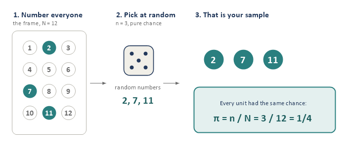
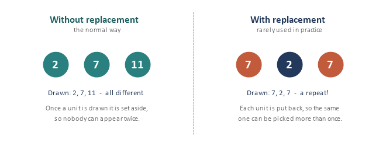
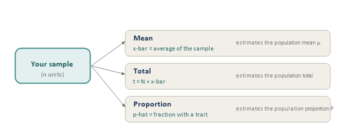
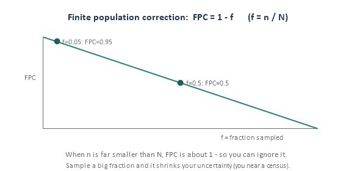
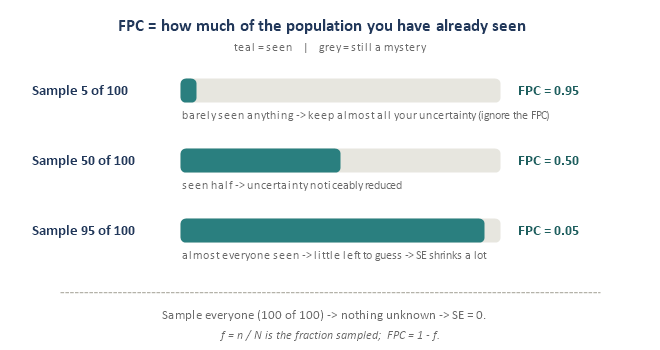
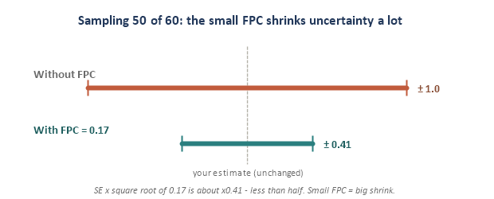
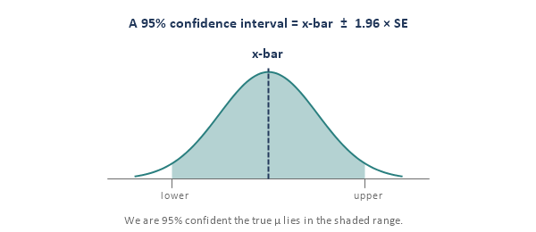
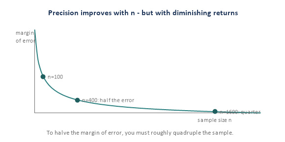

Simple random sampling (SRS) is the simplest probability design and the **yardstick** every fancier method is measured against. This module builds it in six small pieces. The math here is gentle — each formula is stated in plain words with a tiny example — and reading it is optional; the live sessions still go one piece at a time.

## Piece 1 — What SRS is (the fair lottery)

**Definition:** put every unit of your frame in a hat, mix well, and draw n of them purely by chance — every unit has the same chance of being picked. In practice you do not use a literal hat; you **number the frame and let random numbers choose**.

{fig-align="center"}

Two properties define SRS:

- **Equal chance for every unit:** each inclusion probability is pi = n / N.
- **Every possible sample of size n is equally likely** — the stricter definition the math rests on.

::: {.keyline}
**pi = n / N**
:::

Why it is the benchmark: a **machine decides, not a person**, which removes selection bias and makes estimates **unbiased**. It is the reference other designs are compared to. One caveat: SRS needs a **complete list of the whole population** so you can number everyone — easy for "students at a university," hard for "all adults in a country," which is why later modules exist.

## Piece 2 — With or without replacement

{fig-align="center"}

- **Without replacement (SRSWOR):** once a unit is drawn it is set aside, so nobody appears twice. This is the normal, real-world version.
- **With replacement (SRSWR):** each unit is put back, so a unit can be picked more than once. Rare in practice; it exists mainly because the math is a touch simpler. We default to **without** replacement.

The practical difference: without replacement is slightly more precise (you never "waste" a draw on someone you already have), and that gain is captured by the finite population correction in Piece 4.

## Piece 3 — What you estimate from an SRS

From one SRS you can estimate three things. In each case the sample quantity is an **unbiased** guess of the matching population quantity.

{fig-align="center"}

- **Mean:** x-bar = the average of your n values; it estimates the population mean mu.
- **Total:** t-hat = N \* x-bar; it estimates the population total.
- **Proportion:** p-hat = (number with the trait) / n; it estimates the population proportion P. (A proportion is just a mean of 0s and 1s.)

**Tiny example.** From N = 1,000 students you take an SRS of n = 100 and find average sleep x-bar = 7.1 hrs. Best estimate of the total sleep across all students: t-hat = 1,000 \* 7.1 = 7,100 hrs. If 30 of the 100 are athletes, p-hat = 30/100 = 0.30 estimates the athlete share.

## Piece 4 — How good is the estimate? (standard error and FPC)

Your estimate wiggles from sample to sample (Module 0's bell). The width of that bell is the **standard error (SE)**. For an SRS mean:

::: {.keyline}
**SE(x-bar) = square root of \[ (1 - f) \* s² / n \]**
:::

Here s is the sample standard deviation, n the sample size, and **f = n / N** the sampling fraction. Two plain-language reads: (1) bigger n makes SE smaller (divide by n); (2) the factor **(1 - f)** is the **finite population correction (FPC)**.

{fig-align="center"}

**When can you ignore the FPC?** When you sample a small fraction (rule of thumb f \< 0.05), 1 - f is about 0.95-1.0, so it barely matters. It only bites when you sample a big slice of the population.

**A common confusion: what the FPC does (and does not) change**

There are two different numbers here, and it matters which you mean. The FPC **never** changes your best guess; it only changes your uncertainty.

- **Estimate (x-bar)** — your best guess of the value (for example "average = 7.1 hrs"). The FPC never touches it.
- **Standard error (SE)** — the size of your error bars (for example "plus or minus 0.14"). The FPC changes this, through: **new SE = old SE \* square root of (FPC)**.

So a **small FPC does not mean a small effect** — it is the opposite. The FPC is a multiplier, and a small multiplier shrinks the SE a lot. Here "effect" means **how much the FPC shrinks the SE**: big effect = SE much smaller; no effect = SE unchanged.

Two cases make it concrete (pretend the SE without any FPC would be 1.0):

- **National poll (1,000 of 250 million):** f is about 0, so FPC is about 1. SE \* square root of 1 is about unchanged — **no effect, ignore it**.
- **Sample 50 of 60:** f = 0.83, so FPC = 0.17. SE \* square root of 0.17 is about times 0.41 — SE drops to under half, a **big effect, keep it**.

The chain to remember: **FPC close to 1, square root close to 1, SE basically unchanged, ignore it.** And **FPC small, SE shrinks a lot, keep it.** FPC is only small when you have sampled a big chunk of the population.

{fig-align="center"}

{fig-align="center"}

**Tiny example (continued).** With s = 1.5 and n = 100, f = 100/1,000 = 0.1, so FPC = 0.9. SE(x-bar) = square root of \[0.9 \* 1.5² / 100\] = square root of 0.02025 = about 0.14 hrs.

## Piece 5 — The give-or-take (confidence intervals)

A single estimate is more honest with a range attached. Because the bell is roughly normal, about 95% of samples land within 1.96 standard errors of the truth, which gives:

::: {.keyline}
**95% CI: x-bar ± 1.96 \* SE**
:::

{fig-align="center"}

**Reading it right:** "95% confident" means the **method** captures the true value 95% of the time across many samples — not that there is a 95% chance the truth is in this one interval. Wider interval = less certain; narrower = more.

**Tiny example (continued).** x-bar = 7.1, SE = 0.14, so the 95% CI is 7.1 ± 1.96\*0.14 = 7.1 ± 0.28, i.e. about (6.82, 7.38) hrs.

## Piece 6 — How big should the sample be?

Turn the logic around: decide how precise you want to be (a target margin of error e), then solve for n. Because SE shrinks with the square root of n, precision improves fast at first and then slowly.

{fig-align="center"}

For a proportion with target margin e (worst case p = 0.5):

::: {.keyline}
**n0 = (1.96² \* p(1 - p)) / e²**
:::

::: {.keyline}
**then adjust for a finite population: n = n0 / (1 + n0 / N)**
:::

**Tiny example.** Want a margin of e = 0.03 (3 points). n0 = 3.8416 \* 0.25 / 0.0009 = about 1,067. If the population is N = 1,000, adjust: n = 1,067 / (1 + 1,067/1,000) = about 516. The FPC roughly halves the requirement here because we are sampling a big slice.

## How this comes up in practice

- *"What is a simple random sample?"* A design where every unit — and every possible sample of size n — has an equal chance of selection, giving unbiased estimates and a clean basis for standard errors.
- *"What is the finite population correction and when does it matter?"* The factor (1 - f) that reduces variance when you sample a large fraction; negligible when n is small relative to N (f \< 0.05).
- *"If I want to halve my margin of error, what happens to sample size?"* It roughly quadruples, because precision improves with the square root of n.

## Quick check

1. A teacher draws 10 of 40 names from a hat. Is it an SRS, and what is each student's pi?
2. You sample n = 50 from N = 60. Is the FPC safe to ignore? Why?
3. x-bar = 20, SE = 2. Give a rough 95% confidence interval.
4. You currently have a margin of error of 4 points and want 2. Roughly how much bigger must n get?
