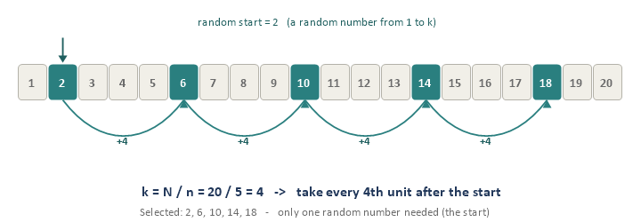
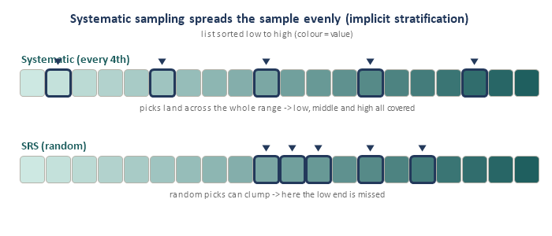
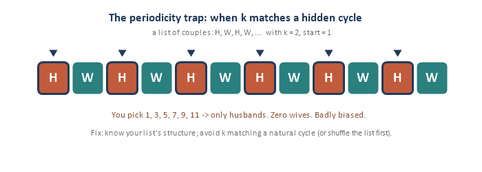
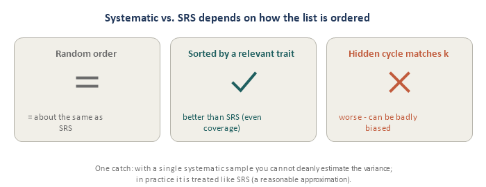

Systematic sampling is SRS's simpler, more practical cousin: order the list, pick one random start, then take every k-th unit. It is the method behind "survey every 10th customer" and "audit every 50th invoice." This module has four short pieces.

## Piece 1 — The 1-in-k method

The whole idea in four steps:

- **1.** **Order your list** (customers in line, names on a roster, invoices by number).
- **2.** **Compute the step, k = N / n** (round to a whole number) — the gap between picks.
- **3.** **Pick a random start** — one random integer between 1 and k.
- **4.** **Take every k-th unit** from there.

{fig-align="center"}

Two things make it special:

- **Only ONE random number** (the start). After that it is pure counting — dead simple, especially in the field, where you may not even need a full list (just a counter: "every 4th person out the door"). SRS, by contrast, needs a numbered frame and n separate random draws.
- **Still a genuine probability sample.** Every unit has a known, non-zero chance: pi = 1 / k = n / N — exactly the same as SRS. So it inherits SRS's fairness and unbiasedness with far less effort.

**One easy slip to avoid:** the random start **is** your first selected unit. With start = 3 and k = 5, the picks are 3, 8, 13, 18, ... (start first, then add k).

Think of systematic sampling as SRS's lazy, efficient cousin: usually just as good, far easier to run — with one catch (the periodicity trap) we meet in Piece 3.

## Piece 2 — Why people use it

Beyond sheer simplicity, systematic sampling has a quietly powerful benefit: it **spreads the sample evenly across the whole list**. If the list happens to be **ordered by something related to what you are measuring** (say, sorted by income, GPA, or region), then stepping through it guarantees you grab some units from every part of the range — low, middle, and high. You cannot accidentally end up with all high-income or all low-income units the way a unlucky SRS draw might.

{fig-align="center"}

This automatic even coverage is called **implicit stratification** — you get the benefit of stratifying (Module 3) without doing any extra work. When the ordering is helpful, systematic sampling is often **more precise than SRS** for the same n.

## Piece 3 — The periodicity trap

Here is the one catch. If the list has a **hidden repeating cycle** whose length matches k (or a multiple of it), you will keep landing on the **same kind of unit** every time — and your sample becomes badly biased.

{fig-align="center"}

Another classic: two years of **daily** sales data with k = 7 — you would sample the **same weekday** every time (say, always a Sunday), giving a wildly unrepresentative picture. The number k collided with the natural 7-day cycle.

**How to avoid it:** know how your list is ordered, avoid a k that matches any natural cycle in the data, and if you are unsure, **shuffle the list first** (which turns it back into an SRS-like draw).

## Piece 4 — How it compares to SRS

Whether systematic sampling beats, matches, or loses to SRS depends entirely on the **order of the list**:

{fig-align="center"}

- **Random order** → essentially the same precision as SRS.
- **Sorted by a relevant trait** → better than SRS (the implicit-stratification bonus).
- **Hidden cycle matching k** → worse, sometimes badly biased.

**One technical catch:** with a single systematic sample you cannot cleanly estimate the variance (you only made one random choice — the start). In practice analysts treat it like an SRS for variance, which is a reasonable approximation when there is no periodicity. Bottom line: systematic sampling is excellent and widely used — just check the ordering first.

## How this comes up in practice

- *"When is systematic sampling better than SRS?"* When the list is ordered by a variable related to the outcome — the even coverage acts like implicit stratification.
- *"What is the main risk?"* Periodicity — a repeating cycle in the list matching k, which biases the sample.
- *"What is each unit's selection probability?"* pi = 1 / k = n / N, the same as SRS.

## Quick check

1. A store surveys n = 20 of the N = 100 visitors today. What is k?
2. If the random start is 3, who are the first three selected?
3. What is each visitor's chance of selection (pi)?
4. Why can systematic sampling be MORE precise than SRS?
5. You have two years of daily sales and use k = 7. What goes wrong, and how would you fix it?
