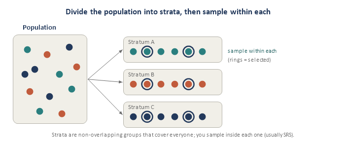
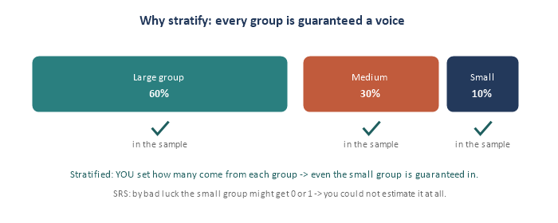
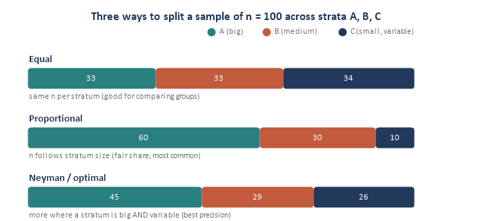
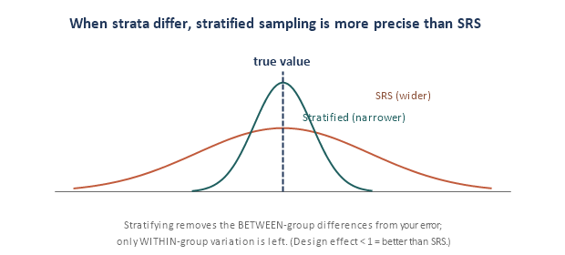

Module 2 gave you *implicit* stratification (even spread for free). Stratified sampling is the **deliberate** version: split the population into meaningful groups and sample within each on purpose. It is one of the most useful designs in real survey work, and it introduces a new decision — **allocation** — for how many units to take from each group. Four pieces.

## Piece 1 — What stratified sampling is

Split the population into **strata** — non-overlapping groups that together cover everyone — then draw a sample **within each stratum** (usually an SRS inside each). Finally, combine the stratum results into one overall estimate.

{fig-align="center"}

The catch on defining strata: you must know each unit's group **for everyone on the frame** before you sample — so strata are built from information you already have (age band, sex, region, school, customer tier). Good strata are **similar inside and different from each other**.

## Piece 2 — Why stratify

Two big payoffs:

- **Guaranteed representation.** You decide how many come from each group, so every group — even a small one — is certain to appear. That also lets you report reliable estimates *for each subgroup*, not just the whole.
- **Precision.** If strata are internally similar but differ from each other, stratifying removes that between-group difference from your error — so your estimate is tighter than SRS for the same n.

{fig-align="center"}

## Piece 3 — Allocation (how many from each stratum)

Once you fix the total sample size n, you must split it across the strata. Three standard schemes:

- **Equal:** the same n in every stratum. Good when you want to compare strata; it over-samples small ones.
- **Proportional:** n\_h = n \* (N\_h / N) — each stratum's share matches its size. Fair, self-weighting, and the most common default.
- **Neyman / optimal:** n\_h is proportional to (N\_h \* S\_h) — put more sample where a stratum is both **big** and **variable**. This gives the best precision for a fixed n. (With differing costs, divide by the square root of cost.)

{fig-align="center"}

**Terminology:** proportional allocation is "proportionate"; equal and Neyman are "disproportionate" (some groups are over- or under-sampled, so you need **weights** to combine them fairly — a preview of Module 6). **Tiny example:** strata of size 600 / 300 / 100 (N = 1,000), with n = 100. Proportional allocation takes 60 / 30 / 10.

## Piece 4 — How much precision you gain

The overall estimate is a **weighted average** of the stratum means, with weights equal to the stratum shares (N\_h / N). The precision win comes from a simple fact:

::: {.keyline}
**stratified error uses only WITHIN-stratum variation — the BETWEEN-stratum differences are removed**
:::

{fig-align="center"}

So the more your strata **differ** from each other (and the more homogeneous each is inside), the bigger the gain. The size of that gain is captured by the **design effect** (Module 4): a value below 1 means "better than SRS." With proportional allocation, stratified sampling is essentially **never worse** than SRS — a rare free lunch, as long as you have a good stratifying variable known for the whole frame.

## Interview angles

- *"Why stratify?"* Guaranteed representation of every group (and subgroup estimates), plus better precision when strata differ.
- *"Proportional vs. Neyman allocation?"* Proportional splits n by stratum size; Neyman also weights by variability, putting more sample where a stratum is both big and variable.
- *"When does stratification help most?"* When strata are homogeneous within and very different between.

## Quick check

1. For big precision gains, should strata be similar or different from each other?
2. Strata of size 600 / 300 / 100 and n = 100 with proportional allocation — how many from each?
3. Which allocation puts more sample where a stratum is both big and variable?
4. In one line, why is stratified sampling often more precise than SRS?
