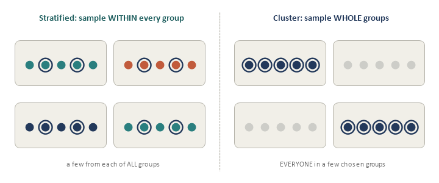
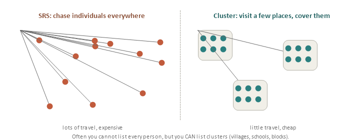
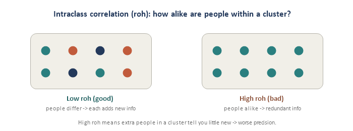
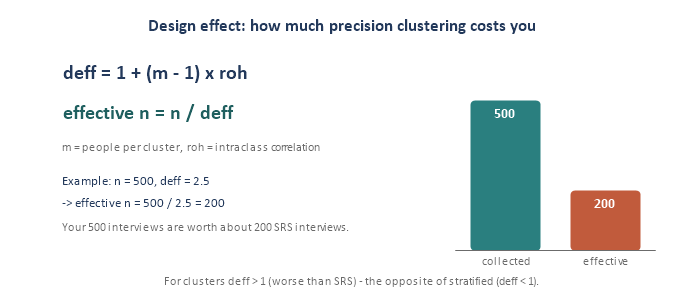

Cluster sampling is the mirror image of stratified sampling. Stratified samples a few units *within every* group to improve precision. Cluster sampling samples *whole groups* and skips the rest — done for cost and practicality, usually at some cost to precision. Four pieces.

## Piece 1 — What cluster sampling is

Group the population into **clusters** — natural groupings like villages, schools, households, or city blocks — then randomly pick a **few whole clusters** and measure **everyone** inside them (this is one-stage cluster sampling). The other clusters are not sampled at all.

{fig-align="center"}

The contrast is worth burning in: **stratified** = "some from all groups" (for precision); **cluster** = "all from a few groups" (for cost). Same raw material — groups — used in opposite ways.

## Piece 2 — Why cluster (cost and frame reality)

Two very practical reasons:

- **The frame.** Often **no list of individuals exists**, but a list of clusters does. There is no roster of "every adult in the country," but there *is* a list of villages, census blocks, or schools. You can only sample from a list you have.
- **The cost.** Concentrating fieldwork in a **few places** is far cheaper than chasing individuals scattered everywhere. Interviewing 20 households on one block costs a fraction of interviewing 20 households in 20 different towns.

{fig-align="center"}

## Piece 3 — The catch: intraclass correlation

Here is the price you pay. People in the same cluster tend to be **similar** — same neighborhood, same school, same income level. So once you have interviewed a few people in a cluster, each **additional** person from that same cluster tells you **less that is new**. That within-cluster similarity is measured by the **intraclass correlation, roh** (also written ICC).

{fig-align="center"}

The higher the roh, the more **redundant** your data, and the **worse** your precision. This is the opposite of stratification: stratified *wants* groups that differ from each other; cluster sampling is **hurt** when the people inside a cluster are too alike.

A crucial contrast to keep straight — stratified and cluster sampling both hinge on within-group similarity, but pull in **opposite** directions:

| **Design** | **What you want in each group** | **Why** |
|---|---|---|
| **Stratified** | Units that **differ between** groups | Between-strata variance is removed, so precision goes **up**. |
| **Cluster** | Units that **differ within** a cluster | But you usually get the opposite — alike units — so redundancy rises and precision goes **down**. |

Same word, "similarity," opposite consequence: in stratification you sample from *every* group, so within-group sameness is fine; in clustering you get only *a few* groups, so within-group sameness means you have seen very little true variety.

## Piece 4 — Design effect and effective sample size

The precision cost is captured by the **deff** — how much bigger your variance is than an SRS of the same size:

::: {.keyline}
**deff = 1 + (m - 1) \* roh**
:::

::: {.keyline}
**effective n = n / deff**
:::

Here m is the number of people per cluster and roh the intraclass correlation. Because roh is positive for clusters, **deff is greater than 1** — worse than SRS (the opposite of stratified, where deff is below 1).

The key 1-liner: **high roh = redundant data = you effectively sampled fewer people than you actually interviewed**. The design effect just turns that redundancy into a \#. Where every design sits relative to SRS:

| **Design** | **deff** | **Meaning** |
|---|---|---|
| **SRS** | = 1 | The baseline. |
| **Stratified** | below 1 | **Better** than SRS — between-group variance removed. |
| **Cluster** | above 1 | **Worse** than SRS — within-group redundancy added. |

Stratified and cluster sit on **opposite sides of 1** — say that in an interview and you have shown you understand both modules at once. Note too that **m multiplies the damage**: even a tiny roh of 0.06 blew up to deff = 2.5 because m was 25, which is exactly why cluster size is the lever below.

{fig-align="center"}

**The tradeoff.** Each interview is cheaper under clustering, but each is "worth less." The design lever is cluster size: **fewer, bigger clusters** are cheap but have high deff (lots of redundancy); **more, smaller clusters** cost more travel but give lower deff (better precision). Good cluster design balances cost against the design effect.

## Interview angles

- *"Why use cluster sampling?"* Cost and frame practicality — you may only have a list of clusters, and concentrating fieldwork is cheap.
- *"What is the design effect?"* The ratio of your design's variance to an SRS of the same size; deff \> 1 means you need a larger sample to match SRS precision.
- *"What is roh / intraclass correlation?"* How similar units are within a cluster; higher roh raises the design effect and lowers effective sample size.

## Quick check

1. Which design samples WHOLE groups and skips the rest — cluster or stratified?
2. n = 400 with deff = 2. What is the effective sample size?
3. Does a high intraclass correlation (roh) help or hurt your precision?
4. In one line, why do people use cluster sampling despite the precision cost?
