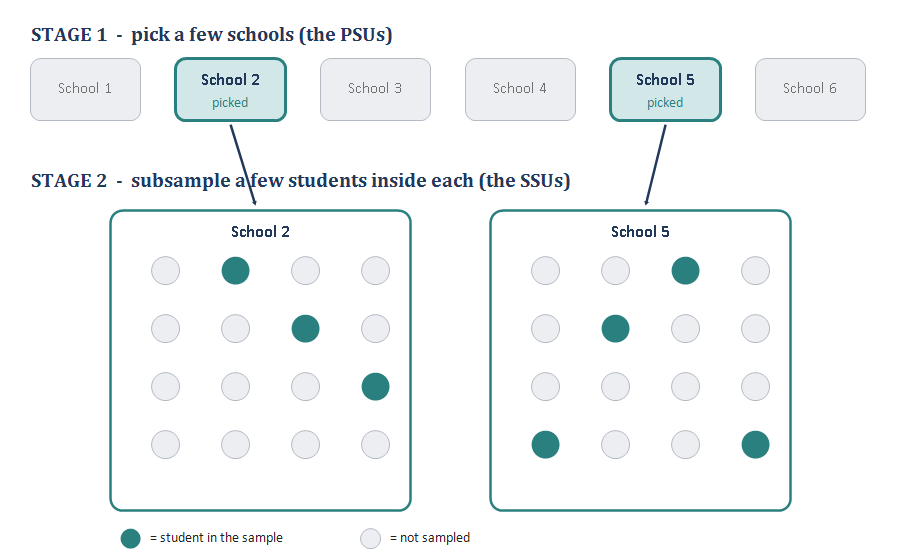
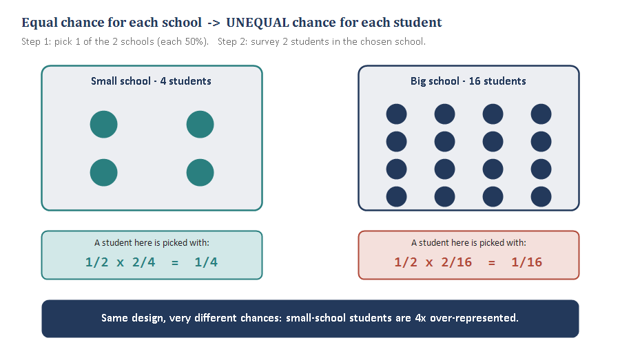
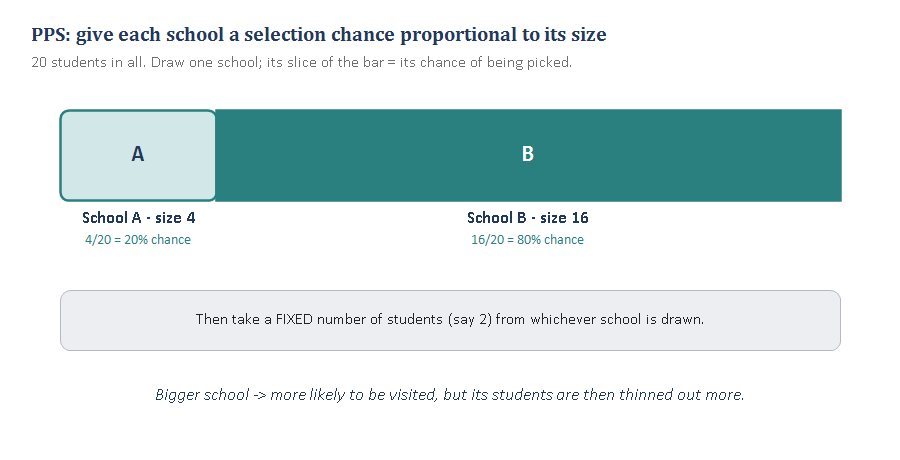
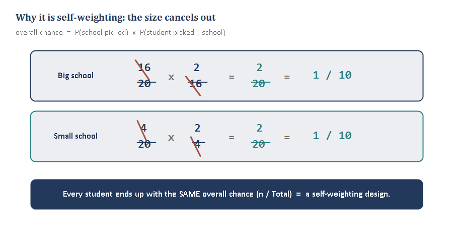

In cluster sampling you took whole groups and measured everyone in them. Multistage keeps the cost savings of clustering but samples *within* the chosen groups too — and PPS is the trick that keeps everyone's chance of selection equal. This module builds those ideas one small piece at a time, the same way we walked through them together.

## Piece 1 — What “multistage” means (PSUs and SSUs)

In **cluster sampling** (Module 4), once you picked a school you measured **everyone** in it. That's fine when clusters are small, but real schools have hundreds of kids — you can't survey all of them in every school you land on.

**Multistage sampling** fixes that by sampling in *steps*:

- **Stage 1:** from the full list of schools, randomly pick a **few schools**.
- **Stage 2:** inside each chosen school, don't take everyone — randomly pick a **handful of students**.

That's a **two-stage** design. You could keep going (schools, then classrooms, then students = three stages), which is where the “multi” comes from.

The vocabulary just names the units at each stage:

- **PSU — Primary Sampling Unit** = what you pick *first*. Here, the **school**.
- **SSU — Secondary Sampling Unit** = what you pick *second*, inside a PSU. Here, the **student** (or the classroom, if there's a stage in between).

{fig-align="center"}

::: {.fieldnote}
**Cluster = pick groups, take everyone. Multistage = pick groups, then sample** ***within*** **them too.**
:::

The big practical payoff: you get the **cost savings** of clustering (your fieldworker only visits a few schools) **without** being forced to interview every single person in those schools.

**Cluster vs. multistage at a glance**

|  | **Cluster sampling** | **Multistage sampling** |
|---|---|---|
| **Inside a chosen group** | measure everyone | subsample — take only some |
| **Stages of selection** | one (pick clusters) | two or more (PSUs, then SSUs, …) |
| **Cost per group visited** | higher (interview all) | lower (interview a few) |
| **Watch out for** | big design effect if roh is high | unequal selection chances (see Piece 2) |

**One thing to keep straight:** don't mix up the **cluster** (the group, e.g., the school) with the **element** (the unit, e.g., the child). The mantra from Module 4 still holds — *sample clusters, measure elements* — and now we add: *… but in multistage you sample the elements too.*

::: {.fieldnote}
**Check yourself (Piece 1).** Can you tell me, in your own words, the difference between what happens *inside a chosen cluster* under plain cluster sampling vs. under multistage?
:::

## A quick aside — PPS vs. PPeS (the “e”)

You asked what PPeS is, so let's pin down the pair before we build up to it.

- **PPS = Probability Proportional to Size.** When you pick your PSUs (schools), you give **bigger schools a proportionally bigger chance** of being selected. A school with 800 kids is twice as likely to be picked as one with 400. (This is Piece 3 — the fix for the problem in Piece 2.)
- **PPeS = Probability Proportional to** ***estimated*** **Size.** Same idea, but with a catch: in the real world you often **don't know each school's exact current enrollment** when you draw the sample. So you use the **best available estimate** — last year's census, an old administrative file — as your “measure of size.”

The only difference is the **“e”**:

|  | **Measure of size used** | **When to use it** |
|---|---|---|
| **PPS** | the *true, exact* size | you actually have current counts |
| **PPeS** | an *estimate / proxy* of size | true size is unknown or outdated (the usual real-world case) |

The consequence: with PPS you can make the design **perfectly self-weighting** (every person has an identical overall chance). With PP**e**S, because your sizes are a little off, it comes out *almost* self-weighting, and weighting tidies up the rest (Module 6). We'll see exactly why in Piece 4.

## Piece 2 — Why equal chance for schools is unfair to students

Here's the wrinkle multistage introduces. Keep it as simple as possible: **2 schools**, we pick **1 of them** (each 50%), then survey **2 students** in whichever we picked. One school is **small** (4 students), the other **big** (16 students).

Work out a single student's **overall** chance of being surveyed — multiply the two stages together:

- In the **small** school: P(school picked) × P(student picked \| picked) = 1/2 × 2/4 = 1/4.
- In the **big** school: 1/2 × 2/16 = 1/16.

{fig-align="center"}

So a student in the small school is **four times** as likely to end up in the sample as a student in the big school — even though we did nothing “unfair” on purpose. **Equal chance for the clusters produced very unequal chances for the elements.**

| **School** | **Students** | **P(school picked)** | **Take** | **P(student\|picked)** | **Overall** |
|---|---|---|---|---|---|
| **Small** | 4 | 1/2 | 2 | 2/4 | **1/4** |
| **Big** | 16 | 1/2 | 2 | 2/16 | **1/16** |

**Why it matters:** if small-school students are over-represented and small schools differ from big ones (rural vs. urban, say), your estimates are **biased** unless you fix it. Two ways to fix it: **(a)** weight afterward (Module 6), or **(b)** design it away up front by making a school's selection chance depend on its size — that's PPS.

::: {.fieldnote}
**The root cause: every school had the same chance, but schools hold different numbers of students. Equal chance for unequal-sized groups = unequal chance for individuals.**
:::

::: {.fieldnote}
**Check yourself (Piece 2).** Suppose the big school had **40** students instead of 16 (still pick 1 of the 2 schools, still survey 2). What's a student's chance in the big school now — and how many times over-represented are the small-school students?
:::

## Piece 3 — PPS: probability proportional to size

The fix is elegant. Instead of giving every school the **same** chance, give each school a chance **proportional to how many students it has**. Big schools are more likely to be drawn; small schools less likely — in exact proportion to size.

Concretely: **20 students** across the two schools. School A has 4 (that's 4/20 = 20% of all students); School B has 16 (16/20 = 80%). Under PPS, School A is drawn 20% of the time and School B 80% of the time.

{fig-align="center"}

Then — and this is the second half of the trick — you take a **fixed number** of students (say 2) from whichever school is drawn. Notice the tug-of-war this sets up:

- A **big** school is much more likely to be visited (good chance for its students)… but once visited, its 2 sampled students are drawn from a big pool, so each individual is *diluted*.
- A **small** school is rarely visited… but if it is, its 2 students come from a tiny pool, so each is *concentrated*.

These two forces pull in opposite directions. In Piece 4 we'll see they cancel **exactly**.

::: {.fieldnote}
**PPS trades an equal chance of picking the** ***school*** **for a fair chance of picking the** ***person*****.**
:::

::: {.fieldnote}
**Check yourself (Piece 3).** Under PPS, School B (size 16) is visited 80% of the time but we still survey only 2 of its students. Compared with the old equal-chance design (50%), is a Big-school student now **more** or **less** likely to be surveyed — and why?
:::

## Piece 4 — Self-weighting designs (and where PPeS lands)

Now put the two halves together and watch the magic. A student's overall chance is still P(school picked) × P(student \| picked). Under PPS:

- **Big** school: (16/20) × (2/16) = 2/20 = 1/10.
- **Small** school: (4/20) × (2/4) = 2/20 = 1/10.

The school's **size** appears once on *top* (in the selection chance) and once on the *bottom* (in the within-school chance), so it **cancels**. Every student — big school or small — ends up with the same overall chance, 1/10.

{fig-align="center"}

A design where every element has the **same overall probability** of selection is called **self-weighting**. The name says it: because everyone's chance is equal, no unequal weights are needed to correct the estimate — you can (roughly) just take a simple average.

**The general rule:** if you draw PSUs with probability proportional to size and then take a **fixed number** *n* of elements from each drawn PSU, every element's chance = n / (total elements). Constant, by construction.

**The same two schools, now under PPS**

| **School** | **Size** | **P(picked) — PPS** | **Take** | **P(student\|picked)** | **Overall** |
|---|---|---|---|---|---|
| **Small** | 4 | 4/20 | 2 | 2/4 | **1/10** |
| **Big** | 16 | 16/20 | 2 | 2/16 | **1/10** |

*Every overall chance is the same (1/10) — the mark of a self-weighting design. Compare with Piece 2, where the same two schools gave 1/4 vs. 1/16.*

**Where PPeS comes in:** all of this assumed we knew each school's *exact* size. In practice we use **estimated** sizes (PPeS). If last year's enrollment is a little off from today's, the sizes don't cancel *perfectly*, so the design is **almost** self-weighting. That small leftover imbalance is mopped up with weights in Module 6 — which is exactly why weighting is the next module.

::: {.fieldnote}
**Self-weighting = every element has the same overall chance of selection. PPS at stage 1 + a fixed take at stage 2 gets you there; PPeS gets you close.**
:::

::: {.fieldnote}
**Check yourself (Piece 4).** In your own words, why does making a school's selection chance proportional to its size make the whole design self-weighting? What exactly cancels?
:::

## Module 5 in one breath

- **Multistage** = sample groups, then subsample *within* them (PSUs, then SSUs).
- **Equal chance for groups** makes **unequal chance for people**, because groups differ in size.
- **PPS** fixes it by giving each group a selection chance proportional to its size.
- **PPS + a fixed take per group = self-weighting**: everyone shares one overall chance, n/Total.
- **PPeS** uses estimated sizes when true sizes are unknown: almost self-weighting, with weighting to finish (Module 6).
