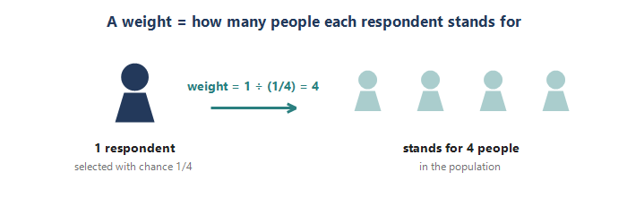
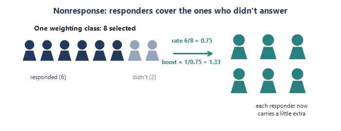
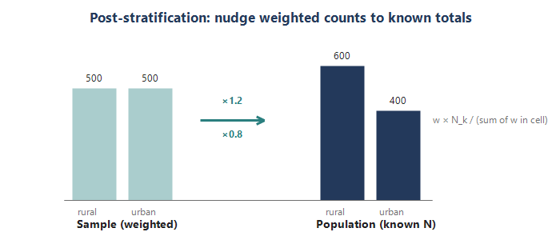
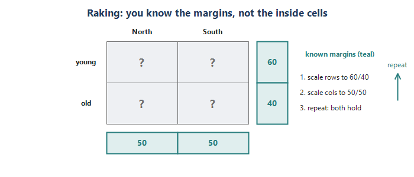
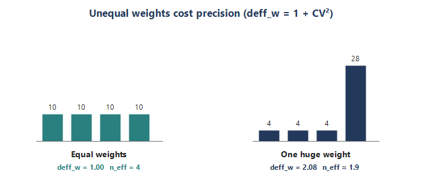

Module 5 ended on a happy accident: PPS made every person share one selection chance, so a plain average worked — a **self-weighting** design. Most real surveys are not that tidy. People are sampled with **different** probabilities, some invited people **never answer**, and the responding sample rarely matches the population on things like age, region, or size. **Weighting** is how we repair all three so the sample speaks for the whole population again. It is the workhorse step between drawing a sample and analyzing it — and it is exactly what you did on the CHOP hospital survey. Five pieces.

## Piece 1 — What a weight is (the base weight)

A weight tells you **how many population units each sampled unit stands for**. The starting point is the **base weight** (also called the *design weight*): the inverse of the unit's probability of selection.

- **Base weight = 1 / (probability of selection).** A unit picked with chance 1/10 represents 10 people, so its weight is 10.
- **Small chance → big weight.** A rarely sampled unit is common in the population, so it stands for many; a frequently sampled unit stands for few.
- **Weights expand to the population.** Add up everyone's weights and you should land back near the population size N.

This is the same idea that made Module 5's self-weighting design so clean. There, everyone shared one selection chance (n / Total), so everyone got the **identical** base weight — and a simple average already worked. Weighting starts to matter the moment selection chances **differ**: disproportionate stratification, oversampling a rare group, or unequal cluster sizes without PPS.

**Tiny example.** Population of 1,000, SRS of 100: each person's chance is 100/1000 = 1/10, so every base weight is 10. Now suppose you deliberately oversample — 50 people from a 200-person *rural* stratum (chance 1/4, weight 4) and 50 from an 800-person *urban* stratum (chance 1/16, weight 16). A rural respondent stands for 4 people; an urban respondent stands for 16. If you forgot the weights and just averaged, rural voices would count four times too heavily.

{fig-align="center"}

**Selection chance turned into a weight**

| **Selection chance** | **Base weight (1 / chance)** | **Reads as** |
|---|---|---|
| 1 / 10 | 10 | stands for 10 people |
| 1 / 4 (rural) | 4 | stands for 4 people |
| 1 / 16 (urban) | 16 | stands for 16 people |

::: {.fieldnote}
**In your CHOP work.** The hospital survey used a stratified design with proportionate allocation, so every hospital's selection chance was almost identical (about 0.29) and the base (selection) weight was a nearly constant ~3.4 across all five regions. That is an *almost self-weighting* design — the same tidy situation as Module 5 — which is exactly what proportionate allocation buys you.
:::

::: {.fieldnote}
**Check yourself (Piece 1).** A respondent was selected with probability 1/25. What is their base weight, and in one line, what does that number mean?
:::

## Piece 2 — Nonresponse adjustment

Even a perfectly drawn sample loses people: some selected units never respond. If the non-responders **differ** from the responders, simply dropping them biases your estimates. The fix is to let the responders who resemble the missing units carry a little extra weight.

- **Build weighting classes.** Group all selected units — responders and non-responders alike — into cells from characteristics you know for *everyone* (region, size, ownership, ...).
- **Boost by 1 / response rate.** Within each cell, multiply each responder's base weight by 1 / (the cell's response rate). Low-response cells get the biggest boost.
- **The modern equivalent.** Instead of coarse cells, model the *probability of responding* (e.g. a logistic regression on known covariates), get each responder's predicted response propensity, and multiply the base weight by 1 / propensity. Weighting classes are just this with a simple, cell-shaped model.

**Why it is even possible:** the adjustment variables must be known for the **non-responders** too. You never see a non-responder's survey answers, but you do see their frame characteristics — and that is what lets you model who was likely to respond.

**Tiny example.** In one weighting class you selected 40 units and 30 responded, a response rate of 0.75. The nonresponse factor is 1/0.75 = 1.33. A responder whose base weight was 10 now carries 10 x 1.33 = 13.3 — covering themselves plus the 0.33 "share" of a similar unit that did not answer.

{fig-align="center"}

**A weighting class, worked out**

| **Class** | **Selected** | **Responded** | **Response rate** | **NR factor (1 / rate)** |
|---|---|---|---|---|
| A | 40 | 30 | 0.75 | 1.33 |
| B | 60 | 30 | 0.50 | 2.00 |

Class B responded worse (0.50), so its responders each carry a larger boost (2.00) — they represent more of the missing.

::: {.fieldnote}
**In your CHOP work.** You modeled response for all 977 selected hospitals with a logistic regression on pre-survey attributes known for *every* hospital (stratum, ED-volume category, total beds, ownership, psychiatric, critical-access, teaching). Each responding hospital's nonresponse adjustment was 1 / its predicted response probability, so the hospitals least likely to respond carried the most weight. Overall response was 606 / 977 = 62%. Multiplying the two components gives the raw adjusted weight: w\_raw = w\_selection x w\_nonresponse.
:::

::: {.fieldnote}
**Check yourself (Piece 2).** A weighting class had 50 selected and 40 responders. What is the nonresponse adjustment factor, and whom does that boost represent?
:::

## Piece 3 — Post-stratification (matching known totals)

After base weights and the nonresponse boost, your weighted sample can still be off from the population on characteristics you actually **know** for the whole population — from a census or an administrative frame. **Post-stratification** nudges the weights so the weighted counts hit those known totals exactly.

- **Form post-strata.** Cells built on variables whose population totals N\_k you know (age band, region, ...).
- **Scale to the control total.** Within each cell, multiply every weight by N\_k / (sum of the current weights in that cell). Now the cell's weights sum to exactly N\_k.
- **Two payoffs.** It removes leftover imbalance from sampling and nonresponse on those variables, and it usually tightens estimates related to them (you are borrowing the known population structure).

**How this differs from stratification (Module 3):** stratification is a design choice made *before* you sample — you control how many units n\_h to draw from each group. Post-stratification is a repair made *after* data collection — you adjust the weights so they match N\_k. Same algebra, opposite ends of the study.

**Requirement:** you need the population control totals, and enough responding sample in every cell — thin cells make the scaling unstable, a very common practical headache.

**Tiny example.** The population is 600 rural / 400 urban. After nonresponse weighting your weights happen to sum to 500 rural / 500 urban. Post-stratify: rural factor 600/500 = 1.2, urban factor 400/500 = 0.8. Now the weighted totals read 600 / 400 — matching the population.

{fig-align="center"}

**Post-stratification, worked out**

| **Cell** | **Pop total N\_k** | **Sum w before** | **Factor** | **Sum w after** |
|---|---|---|---|---|
| rural | 600 | 500 | 1.20 | 600 |
| urban | 400 | 500 | 0.80 | 400 |

::: {.fieldnote}
**In your CHOP work.** You post-stratified (calibrated) the raw adjusted weight to control totals defined by geography, teaching vs non-teaching, and critical-access status. Because some cross-class cells had too few responding hospitals, you manually collapsed them into **13 stable post-strata**, then scaled each cell's weights to its control total N\_k. The final weights sum to the true population of 4,321 hospitals — the formula was w\_calibrated = w\_raw x N\_k / (sum of w\_raw in the post-stratum).
:::

::: {.fieldnote}
**Check yourself (Piece 3).** In a post-stratum the population total is 300 and your weights currently sum to 250. What factor do you apply, and what will the weights sum to afterward?
:::

## Piece 4 — Calibration and raking (from the margins)

Post-stratification needs the **full joint** population counts — the age-by-region table, every cell. Often you only know the **margins**: the age distribution and the region distribution *separately*, not how they cross. **Calibration** is the general family of methods that force weighted totals to match known control totals; **raking** (iterative proportional fitting) is the workhorse for the margins-only case.

- **Raking, step by step.** Post-stratify on the first margin (weights now match age); then on the second (weights match region, but age drifts slightly); then back to age, and so on — iterating until both margins hold at once. Each pass is just the Piece-3 scaling on one margin.
- **Post-strat vs raking.** Post-stratification calibrates to full *joint* cells; raking calibrates to the *margins*, one at a time, repeatedly.
- **Why raking wins in practice.** Joint cell counts are often unknown or too thin, but margins are almost always available (the Census hands you age totals and region totals easily). Raking matches many variables without ever needing their joint distribution.

**Calibration** is the umbrella term — post-stratification, raking, and regression (GREG) calibration are all members. The shared principle: change the weights as *little as possible* so that the weighted totals equal the known control totals.

**Tiny example.** A 2x2 table of age (young / old) by region (North / South). You know the margins — 60 young / 40 old, and 50 North / 50 South — but not the four inside cells. Raking: scale the rows so young/old sum to 60/40; then scale the columns so North/South sum to 50/50 (the rows drift a hair off); repeat. After a couple of passes both margins hold.

{fig-align="center"}

**Post-stratification vs. raking**

|  | **Post-stratification** | **Raking** |
|---|---|---|
| **What you need** | full joint cell totals | only the separate margins |
| **Use when** | joint counts known, cells full | only margins known / cells thin |
| **One pass** | scale each cell to N\_k once | scale one margin, then the next, repeat |

::: {.fieldnote}
**In your CHOP work.** CHOP actually had the *joint* control totals (the 13 collapsed cross-class cells), so you post-stratified directly rather than raked. Raking is what you reach for when only the *separate* margins are available — for example, aligning a national poll to Census age, sex, region, and education totals that you have one at a time but not jointly.
:::

::: {.fieldnote}
**Check yourself (Piece 4).** You want your weights to match the population on both sex and region, but you only have each total separately (not the sex-by-region table). Which method do you use, and what does one "pass" of it do?
:::

## Piece 5 — Why weights change your estimates

Weighting fixes bias, but it is not free. **Unequal weights inflate the variance** of your estimates — wider confidence intervals and a smaller effective sample size. The more the weights vary, the higher the price.

- **The weighting design effect.** deff\_w = 1 + CV^2(w) = 1 + variance(w) / mean(w)^2. Equal weights give CV = 0 and deff\_w = 1 (no penalty — the self-weighting case). Spread-out weights push deff\_w above 1.
- **The "1 + L" statistic.** This is the same quantity survey shops report, with L = CV^2 of the weights. deff\_w = 1.10 means about 10% variance inflation from the weights.
- **Effective sample size.** n\_eff = n / deff\_w. Your respondents, with variable weights, "act like" fewer than their headcount for precision — the exact echo of Module 4's cluster deff and effective n.
- **Trimming.** A few enormous weights (rare units standing for huge chunks of the population) blow up variance. Trimming caps them at a ceiling and redistributes the excess — trading a little bias for a lot of stability. It is a judgment call.

The underlying tension: **every adjustment** — nonresponse, post-stratification, raking — reduces bias but tends to spread the weights and lift deff\_w. Good weighting keeps that balance in view.

**Tiny example.** Four respondents with weights 10, 10, 10, 10: CV = 0, so deff\_w = 1 and n\_eff = 4. Change them to 4, 4, 4, 28 (same total, 40): the mean is 10, the variance is 108, so CV^2 = 1.08, deff\_w = 2.08, and n\_eff = 4 / 2.08 = about 1.9. The same four people now carry the precision of only two.

{fig-align="center"}

**Weight spread turns into lost precision**

| **Weights (of 4)** | **CV^2** | **deff\_w** | **n\_eff** |
|---|---|---|---|
| 10, 10, 10, 10 | 0.00 | 1.00 | 4.0 |
| 4, 4, 4, 28 | 1.08 | 2.08 | 1.9 |

::: {.fieldnote}
**In your CHOP work.** You tracked exactly this — the 1 + L statistic — before and after calibration: **1.02 before, 1.05 after**. So calibration added only about three points of variance inflation in exchange for its bias correction, and the final weights inflate variance by at most ~5% (deff\_w about 1.05, so n\_eff is about 606 / 1.05 = 577 hospitals). A very mild, well-behaved price — which is what it means when the documentation says the weights "passed all the checks."
:::

::: {.fieldnote}
**Check yourself (Piece 5).** If a set of weights has deff\_w = 1.25 and you have 500 respondents, what is your effective sample size, and what is trimming trying to accomplish?
:::

## Interview angles

- **"What is a survey weight?"** 1 / the probability of selection — how many population units each respondent represents — then adjusted for nonresponse and calibrated to known population totals.
- **"Base weight vs final weight?"** Base = the design weight (1 / selection probability). Final = base x nonresponse adjustment x calibration / post-stratification factor.
- **"Post-stratification vs raking?"** Post-stratification matches the full joint cell totals; raking matches the margins one at a time, iterating, when the joint totals are not available.
- **"Why not weight as hard as possible?"** Unequal weights inflate variance (deff\_w = 1 + CV^2) and shrink the effective sample size; trimming curbs extreme weights. You balance bias reduction against variance.
- **"When does weighting barely matter?"** When the design is self-weighting and the weights are uncorrelated with the outcome — then weighted and unweighted estimates nearly agree (a point your own CHOP documentation makes).

## Quick check

1. A respondent's selection probability was 1/20. What is the base weight, and what does it represent?
2. A weighting class had 60 selected and 45 responders. What is the nonresponse adjustment factor?
3. Post-stratification vs raking — which needs the full joint population cell counts, and which needs only the margins?
4. Weights of 5, 5, 5, 25 (mean 10): does deff\_w exceed 1, and what happens to the effective sample size?
5. In one line, name the three multiplicative pieces of a final survey weight.

## Module 6 in one breath

- A weight = 1 / selection chance: how many people each respondent stands for.
- Nonresponse adjustment boosts responders by 1 / response propensity to cover those who did not answer.
- Post-stratification scales weights to known joint population totals; raking does it from the margins alone, iterating.
- Final weight = base x nonresponse x calibration.
- Unequal weights cost precision: deff\_w = 1 + CV^2, and n\_eff = n / deff\_w — so watch the weight spread (and trim extremes).

*End of Module 6. Next up: Module 7 — Design-based analysis and variance estimation (getting correct standard errors out of these weights).*
