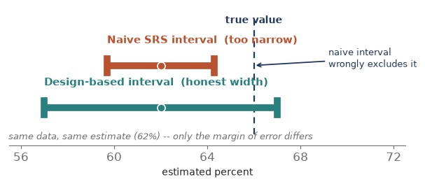
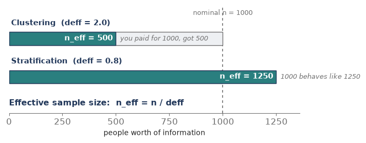
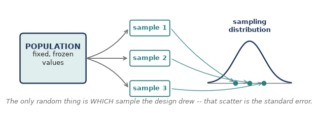
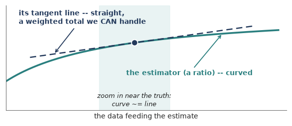
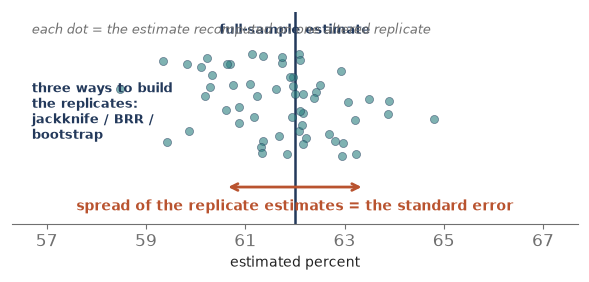

Module 6 handed you a clean set of weights — base weight, nonresponse adjustment, calibration — so the sample now stands in for the population without bias. But a number on its own is only half an answer. The other half is **how sure are we?** Every estimate needs a margin of error, and here is the trap: the tidy standard-error formula from Module 1 assumed a **simple random sample**. Real designs — stratified, clustered, weighted — break that assumption. Feed complex-design data into the SRS formula and the point estimate may be fine, but the margin of error comes out wrong, and almost always **too small** — leaving you more confident than the data deserve. Module 7 is about the honest standard error: analyzing the data the same way you sampled it. That habit is **design-based analysis**. Seven pieces of concept — then a hands-on eighth that does the whole thing in R.

## Piece 1 — Why the naive standard error is wrong (the overconfidence trap)

The SRS formula, standard error = s / sqrt(n), rests on one picture: **n independent draws**, each with an equal, independent chance. Complex designs break that picture, and each way of breaking it bends the true standard error away from what the naive formula reports.

- **Clustering makes it worse.** People in the same cluster — a school, a hospital, a city block — resemble each other (the intraclass correlation from Module 4). Twenty pupils from one classroom carry less independent information than twenty pupils from twenty classrooms. The naive formula counts them as twenty fresh draws, so it **understates** the true error — overconfidence.
- **Unequal weights make it worse too.** When respondents carry very different weights, a few heavily weighted people swing the estimate around. That extra bounce is real variance the SRS formula never sees, so again the naive error is **too small** (the deff\_w = 1 + CV^2 cost from Module 6).
- **Stratification makes it better.** Sampling within every stratum removes the between-stratum variation from the error, so the true error is **smaller** than SRS. Ignore the strata and the naive error is merely **too large** — conservative, not dangerous.
- **A large sampling fraction helps as well.** The finite population correction shrinks the true error when you sample a big slice of a small population. Ignore it and, again, you are only being conservative.

Put the directions together and the danger is plain: the two features that dominate most real surveys — **clustering and unequal weights** — push the naive error **downward**. So the default mistake is a confidence interval that is too narrow and a p-value that is too small: **false precision**. Design-based analysis exists to undo exactly that.

**Which way each design feature bends the error**

| **Design feature** | **What it does to true precision** | **Naive SRS error comes out...** |
|---|---|---|
| Clustering (PSUs) | lowers it | too small (overconfident) |
| Unequal weights | lowers it | too small (overconfident) |
| Stratification | raises it | too large (conservative) |
| Large sampling fraction (fpc) | raises it | too large (conservative) |

{fig-align="center"}

## Piece 2 — The design effect: one number for the whole story

Module 4 introduced the **design effect**; here it becomes the master gauge for the entire analysis. The design effect is the ratio

**deff = (variance under your actual design) / (variance under an SRS of the same size).**

It is the price tag your design puts on precision.

- **deff \> 1**: your design **lost** precision versus SRS (clustering, unequal weights).
- **deff = 1**: same as SRS.
- **deff \< 1**: your design **beat** SRS (stratification).
- **The honest standard error = (naive SRS error) x sqrt(deff).** That single multiplier is the whole repair.

And the design effect converts straight into an **effective sample size**: n\_eff = n / deff. A clustered sample of 1,000 with deff = 2.0 carries the information of only **500** independent people — you paid for 1,000 and got 500. A well-stratified sample of 1,000 with deff = 0.8 behaves like **1,250**.

**Tiny example.** Suppose the naive SRS error is 1.5 points and the design effect is 1.44. Then sqrt(1.44) = 1.2, so the honest error is 1.5 x 1.2 = **1.8 points**, and the confidence interval widens by 20 percent. Same estimate, a franker margin.

**The weight piece.** Unequal weights alone contribute a design effect of deff\_w = 1 + CV^2(weights) = n x (sum of w^2) / (sum of w)^2 — Kish's formula from Module 6. Clustering multiplies on top of that, which is why big national surveys often run an overall deff of 1.5 to 3.

{fig-align="center"}

::: {.fieldnote}
**In your CHOP work.** The hospital survey was stratified by region with a nearly constant weight (~3.4) — an almost self-weighting design, so its design effect sits just *below* 1. Handed to an ordinary statistics package as though it were an SRS, the standard errors would come out slightly **too large**; declared properly as a stratified design, the intervals tighten to their honest width. Ignoring the design would not have fooled you here (it errs safe), but it would have cost you real precision you had already earned through stratification.
:::

## Piece 3 — Design-based thinking (where the uncertainty lives)

Before the two repair methods, one idea decides everything: **where does the uncertainty come from?**

- **Design-based view.** The population values are **fixed, frozen numbers.** The only random thing is *which units your design happened to draw.* Imagine rerunning your exact sampling plan thousands of times over the same frozen population — the estimate jumps from run to run, and that jumping **is** the standard error. No assumption about how the data were generated; only the sampling mechanism you yourself chose.
- **Model-based view.** Assumes a probability model produced the values (say, a regression with random errors), and the uncertainty flows out of that model.

Survey sampling is traditionally **design-based**, and the motto is short: **analyze it the way you sampled it.** Honor the strata, the clusters, and the weights, because they define the only randomness in the room. This is also why you cannot simply hand the numbers to an off-the-shelf statistics routine: those routines assume independent, identically distributed draws — a model — which is exactly what a complex sample is **not**.

{fig-align="center"}

## Piece 4 — Method 1: Linearization (the tangent-line trick)

**The problem.** The neat variance formulas in sampling are all for **totals and sums** — linear things. But most quantities we actually report are **nonlinear**: a mean, and especially a **ratio** or a proportion, carries the weights in both the numerator and the denominator, and a regression coefficient is messier still. There is no tidy exact variance formula for a ratio.

**The trick.** Replace the curvy estimator with the straight line that just touches it at the true value — its **first-order Taylor expansion**. Locally, any smooth curve looks like its tangent line. That tangent line is a plain weighted **total**, and totals we know how to get a variance for. So we compute the variance of the tangent-line stand-in and hand it back as the variance of the ratio. The thing that gets summed is a set of **residuals** (the linearized variable), and the standard error then comes from how those residuals vary **across PSUs**.

- **Fast.** One pass through the data, a closed-form answer. It is the **default** in every design-based software package.
- **Accurate for smooth statistics** — means, totals, ratios, proportions, regression coefficients.
- **But** it needs a fresh derivation per statistic, and it strains on non-smooth quantities like **medians and other quantiles**, where the tangent-line idea has nothing clean to grab.

{fig-align="center"}

## Piece 5 — Method 2: Replication (measure the wobble)

Instead of a formula, **brute force**. Build many slightly altered copies of your sample, recompute the estimate on each, and watch how much it bounces. The **spread** of those replicate estimates is the standard error — read straight off, no calculus. Each altered copy arrives as its own column of **replicate weights**; you compute the same estimate once per column and look at the scatter. Three standard recipes for making the copies:

- **Jackknife (delete-one).** Drop one PSU (or one group of PSUs) at a time, reweight the rest, recompute. How far each deletion moves the estimate reveals the variance.
- **BRR (balanced repeated replication).** Built for the common *two-PSUs-per-stratum* design: each replicate keeps one of the two halves from every stratum, following a balanced (Hadamard) pattern so a small number of replicates covers all the combinations efficiently.
- **Bootstrap.** Resample PSUs with replacement, many times over, and take the spread.

Why bother, when linearization is faster?

- **One engine, any statistic.** The same procedure handles medians, quantiles, inequality indices, and other awkward quantities with **no special formula** — its decisive advantage over linearization.
- **Agencies love it for public-use files.** They ship a set of replicate-weight columns, and you get correct standard errors **without ever seeing** the confidential strata and cluster IDs.
- **But** it costs more computation (dozens to hundreds of recomputations), and you need either the design details or the replicate weights in hand.

{fig-align="center"}

## Piece 6 — Linearization vs. replication: which, and when

The good news first: for the **smooth** statistics that make up most reports — means, totals, proportions, ratios, regression coefficients — the two methods give **essentially the same** standard error. The choice is about convenience, not correctness.

|  | **Linearization** | **Replication** |
|---|---|---|
| How it works | tangent-line (Taylor) approximation | recompute on many altered replicates |
| Speed | one pass, fast | many passes, heavier |
| Any statistic? | needs a formula each; weak on quantiles | one engine; handles medians & quantiles |
| What you must supply | strata, PSU, weights, fpc | replicate-weight columns (or the design) |
| Public-use files | exposes the design variables | ships replicate weights, hides the design |
| Role in software | the out-of-the-box default | when the statistic is awkward, or weights are provided |

**Rule of thumb.** Reach for **linearization by default**; switch to **replication** when the statistic is non-smooth (a median, a quantile, a Gini index) or when the data arrived with replicate weights already attached.

## Piece 7 — The four ingredients (and the lonely-PSU snag)

Whichever method you use, design-based software must be told **four things**, or it silently falls back to the SRS formula and hands you the overconfident answer:

- **Strata** — the groups you sampled within (the variance is pooled across them).
- **Clusters / PSUs, and their nesting** — the units actually drawn at the first stage; this is where clustering's cost is measured, as variation *between* PSUs.
- **Weights** — the final weights from Module 6, so the estimate expands to the population.
- **Finite population correction** — the sampling fractions, so precision is credited when you sampled a large slice.

**The lonely-PSU snag.** Between-PSU variance needs at least **two** PSUs in every stratum. A stratum with only one sampled PSU leaves the software nothing to compare it against — the **lonely PSU**. The standard fixes are to **collapse** it with a neighboring stratum, or to **center** its contribution at the grand mean instead of its own. Worth knowing by name; it is a classic gotcha, and the reason a run can crash or refuse to report a standard error.

::: {.fieldnote}
**Check yourself (Piece 7).** A national survey gives you strata, PSU identifiers, a final weight, and a finite population correction, but you forget to declare the PSUs. Which direction will your standard errors be wrong, and why?
:::

## Piece 8 — Doing it in R (the survey package)

Everything above is method-agnostic; in practice one package does it all in R — **survey**, by Thomas Lumley. One idea drives the whole package: you **declare the design once** (the four ingredients from Piece 7), and then **every** estimate you ask for is automatically design-correct — honest standard errors, no SRS shortcut. Here is the whole workflow, mapped onto the pieces you just learned.

::: {.fieldnote}
**Read-along, not run.** R is not yet installed on your machine, so treat this piece as a reference — every line is ready to run the moment we set R up. Nothing here changes the concept-first path; it just shows where the ideas land in code.
:::

**1. Install and load.**

::: {.fieldnote}
install.packages("survey")
library(survey)
:::

**2. Declare the design (Piece 7's four ingredients).** This one call is the whole game — name the strata, the PSUs, the weights, and the fpc; everything downstream inherits them.

::: {.fieldnote}
des \<- svydesign(
~~id = ~psu, \# clusters / PSUs
~~strata = ~region, \# strata
~~weights = ~finalwt, \# final weights (Module 6)
~~fpc = ~Nh, \# finite population correction
~~nest = TRUE, \# PSU ids numbered within strata
~~data = mydata)
:::

**3. Design-correct estimates — linearization is the default (Piece 4), and it prints the design effect on request (Piece 2).**

::: {.fieldnote}
svymean(~satisfaction, des) \# estimate + honest SE
svytotal(~satisfaction, des) \# population total
svymean(~satisfaction, des, deff = TRUE) \# ... and the design effect
confint( svymean(~satisfaction, des) ) \# 95% CI
svyby(~satisfaction, ~region, des, svymean) \# by subgroup
:::

**4. Switch to replication when you need it (Piece 5).** Either build replicate weights from your design, or read the columns an agency shipped on a public-use file — then the same svymean call reads the SE straight off the replicates, and quantiles finally work.

::: {.fieldnote}
des\_jk \<- as.svrepdesign(des, type = "JKn") \# jackknife from the design
des\_rep \<- svrepdesign(weights = ~finalwt, \# ... or agency replicate weights
~~~~repweights = "repwt\[0-9\]+", type = "JK1", data = puf)
svymean(~income, des\_rep) \# SE from the replicate spread
svyquantile(~income, des\_rep, 0.5) \# the median (linearization can't)
:::

**5. The lonely-PSU switch (Piece 7).** One line tells survey how to treat a stratum with a single PSU, instead of stopping with an error.

::: {.fieldnote}
options(survey.lonely.psu = "adjust") \# or "average"
:::

**Prefer tidyverse pipes?** The **srvyr** package wraps all of this: as\_survey\_design(...) then group\_by(...) %\>% summarise(svymean(...)) — same engine underneath, dplyr-style syntax on top.

**Each concept, and the survey call that does it**

| **Concept (piece)** | **survey call** |
|---|---|
| Declare design — 4 ingredients (P7) | svydesign(id, strata, weights, fpc, nest) |
| Linearization estimates (P4) | svymean / svytotal / svyby , then confint() |
| Design effect (P2) | svymean(..., deff = TRUE) |
| Replication (P5) | as.svrepdesign() / svrepdesign() ; svyquantile() |
| Lonely PSU (P7) | options(survey.lonely.psu = "adjust") |

::: {.fieldnote}
**Check yourself (Piece 8).** You call svydesign() but leave out weights=. Which of the four ingredients is missing — and will that spoil only your standard errors, or the point estimates too?
:::

## Coursework anchor (625 / 745)

This is the leap from **computing** an estimate to **trusting** it. In the 625/745 material it is the moment you stopped writing s / sqrt(n) and started **declaring the design** — strata, PSUs, weights, fpc — before asking for any standard error, then reading a design effect off the output to see what the design cost you. The 745 track leans specifically on **replicate weights** and the design-based tools that consume them; that hands-on layer — building the design object, asking for a design-correct mean, and pulling out standard errors and confidence intervals — is the next time we open R.

## Interview angles

- **Why not just use SD over root-n on survey data?** Because that formula assumes a simple random sample. Clustering and unequal weights make the true error larger, so the SRS formula leaves you \_ overconfident — intervals too narrow, p-values too small.
- **What is a design effect?** The ratio of your design's variance to an SRS of the same size. deff \> 1 means lost precision (clustering, unequal weights); deff \< 1 means gained (stratification). Honest error = SRS error x sqrt(deff), and n\_eff = n / deff.
- **Linearization vs. replication?** Linearization is a fast Taylor / tangent-line approximation — the software default; replication (jackknife, BRR, bootstrap) recomputes on many altered samples and reads the error off the spread. Same answer for smooth statistics; replication wins for medians and quantiles, and for public-use files with replicate weights.
- **What are replicate weights?** Extra weight columns an agency ships so you can compute correct standard errors by resampling — without ever seeing the confidential strata and cluster IDs.
- **What is a lonely PSU?** A stratum with a single sampled PSU, so between-PSU variance can't be formed; you collapse strata or center at the grand mean to handle it.
- **Design-based vs. model-based?** Design-based treats population values as fixed and the sample as the only randomness; model-based assumes a model generated the data. Survey inference is traditionally design-based: analyze it the way you sampled it.

## Quick check

1. A clustered sample of 800 has a design effect of 2.5. What is the effective sample size, and what does that number mean?
2. Your naive SRS standard error is 2.0 points and the design effect is 1.44. What is the honest standard error?
3. Clustering, unequal weights, stratification: which two usually make the naive SRS error **too small**, and which one makes it **too large**?
4. You need a standard error for the **median** household income from a public-use file that ships replicate weights. Linearization or replication — which is the natural choice, and why?
5. One stratum in your design has only a single sampled PSU. What is this called, and name one fix.

## Module 7 in one breath

- The SRS formula (SD / sqrt(n)) assumes independent, equal-chance draws; complex designs break that, usually making the naive error **too small** — overconfident.
- The **design effect** deff = design variance / SRS variance ties it together: honest error = SRS error x sqrt(deff), and n\_eff = n / deff.
- **Design-based thinking:** population values are fixed; the sample is the only randomness — so analyze it the way you sampled it.
- **Linearization** (tangent-line Taylor approximation) is the fast default; **replication** (jackknife, BRR, bootstrap) reads the error off the spread of many altered samples and handles any statistic.
- Tell the software the **strata, PSUs, weights, and fpc** — and watch for the **lonely PSU**.
- In R, the **survey** package does it all: declare the design once with svydesign(), then every svymean / svytotal / svyby is design-correct; as.svrepdesign() flips you to replicate methods.
