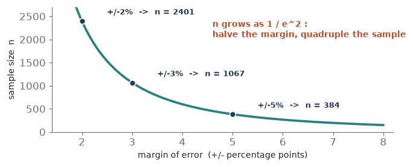
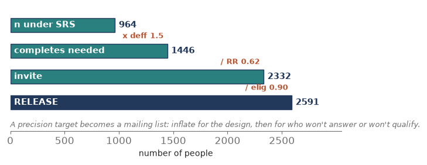
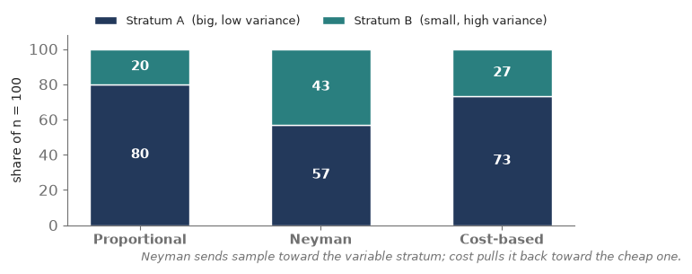
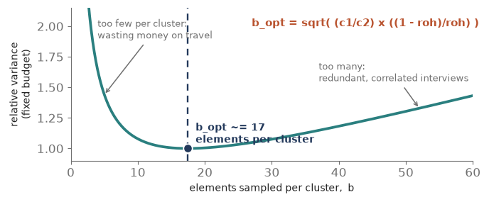
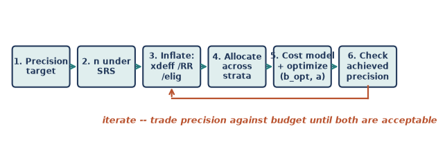

Modules 0 through 7 taught you to draw a sample someone else specified, then analyze it honestly. Module 8 hands you the pencil. **You are the designer now:** given a precision target and a budget, you decide how many people to sample, split how, across how many clusters. This is where sampling stops being analysis and becomes **engineering** — every gain in precision has a price, and the whole craft is spending a fixed budget to buy the most precision you can. R's **PracTools** package is built for exactly this. Six pieces of concept, then a hands-on seventh in R.

## Piece 1 — Sample size for a target precision

Every design starts with a promise about precision — a **margin of error** you will not exceed, at some confidence level. The sample-size question is that promise run **backwards**: the standard-error formulas from Modules 1 and 7 give the error for a chosen n; here we fix the error and solve for n.

- **For a proportion:** n0 = z^2 x p(1 - p) / e^2, where e is the margin of error (the half-width) and z = 1.96 for 95%. The worst case p = 0.5 gives the largest, safest n.
- **For a mean:** n0 = (z x S / e)^2, with S the standard deviation of the variable in the population.
- **Then the finite population correction pulls it back:** n = n0 / (1 + n0/N). It only bites when n0 is a large slice of N.
- **The signature fact:** n depends on 1 / e^2. **Halve** the margin of error and you **quadruple** the sample. Precision gets expensive fast.

**Tiny example.** 95% confidence, margin +/-3 points, p unknown (so use 0.5): n0 = 1.96^2 x 0.25 / 0.03^2 = 0.9604 / 0.0009 = **1,067**. In a population of N = 10,000, the fpc gives n = 1,067 / (1 + 1,067/10,000) = **964**.

**What each margin of error costs (proportion, 95%, p = 0.5)**

| **Margin of error** | **Sample size n0** | **vs. the +/-5% baseline** |
|---|---|---|
| +/- 5 points | 384 | 1x |
| +/- 3 points | 1,067 | ~ 3x |
| +/- 2 points | 2,401 | ~ 6x |
| +/- 1 point | 9,604 | 25x |

{fig-align="center"}

::: {.fieldnote}
**Check yourself (Piece 1).** You currently sample about 1,000 for a +/-3-point margin. A stakeholder now wants +/-1.5 points. Roughly how many will you need, and why?
:::

## Piece 2 — Inflate for the real design (the number to release)

The n from Piece 1 is an **SRS** number — it assumes independent, equal-chance draws and that everyone you pick answers. Neither holds in the field. Three adjustments turn that clean n into the count you actually put in the mail.

- **Design effect.** A clustered or unequally weighted design carries less information per person (Modules 4, 6, 7). Multiply: n\_design = n\_SRS x deff. A deff of 1.5 means you need 50% more people to match the SRS precision.
- **Nonresponse.** Only a fraction answer. Divide by the expected response rate: n\_invite = n\_design / RR.
- **Ineligibility.** Some sampled records are out of scope (disconnected numbers, wrong ages). Divide by the eligibility rate: n\_release = n\_invite / eligibility.

Read it as a chain: **target → n\_SRS → x deff → / response rate → / eligibility → the number to release.**

**Tiny example.** From 964. A design effect of 1.5 → 964 x 1.5 = **1,446** completes needed. A 62% response rate → 1,446 / 0.62 = **2,332** to invite. A 90% eligibility rate → 2,332 / 0.90 = **2,591** to release. You mail about 2,600 records to end up with the precision of 964 clean draws.

{fig-align="center"}

::: {.fieldnote}
**In practice — a stratified facility survey.** This is exactly the arithmetic behind that hospital survey's field counts: **977 records released, 606 responding — a 62% response rate.** Designing the study meant choosing that 977 *before* anyone answered, working from a completes target and an assumed response rate. Run the chain forward and those 606 completes, divided by any design effect above 1, are the effective sample the standard errors actually reflect.
:::

::: {.fieldnote}
**Check yourself (Piece 2).** You need 800 completes, expect a design effect of 1.25 and a 50% response rate. How many do you release (ignore eligibility)?
:::

## Piece 3 — Allocation across strata (now with cost)

Once you know the total n and you are stratifying (Module 3), the next decision is **how to split it** among the strata. Four rules, in rising sophistication.

- **Equal.** The same n in every stratum. Best when you care about each stratum on its own (comparing regions), not the overall total.
- **Proportional.** n\_h proportional to N\_h — each stratum's share of the sample matches its share of the population. Self-weighting and simple.
- **Neyman (optimal for precision).** n\_h proportional to N\_h x S\_h — send sample where the **variability** is. A small but heterogeneous stratum earns extra interviews.
- **Cost-based (optimal for precision per dollar).** n\_h proportional to N\_h x S\_h / sqrt(c\_h) — Neyman, but discount strata that are **expensive** to sample. Cheap, variable strata get the most.

**Tiny example.** Two strata, A (N = 4,000, S = 5) and B (N = 1,000, S = 15), splitting n = 100.

- **Proportional:** 80 / 20 (just the sizes).
- **Neyman:** N\_h S\_h = 20,000 vs 15,000 → 57 / 43. B's high variability pulls sample toward it despite being a quarter the size.
- **Cost-based**, if B costs 4x more per interview (c\_A = 100, c\_B = 400): N\_h S\_h / sqrt(c) = 2,000 vs 750 → 73 / 27. Cost pushes sample back toward the cheap stratum.

**The four allocation rules**

| **Rule** | **n\_h proportional to** | **Best when...** |
|---|---|---|
| Equal | 1 (same each) | you compare strata one-to-one |
| Proportional | N\_h | you want a simple, self-weighting sample |
| Neyman | N\_h x S\_h | you want the most precise overall estimate |
| Cost-based | N\_h x S\_h / sqrt(c\_h) | sampling costs differ across strata |

{fig-align="center"}

::: {.fieldnote}
**Check yourself (Piece 3).** A tiny stratum has huge variance and is cheap to reach. Neyman already gives it a lot of sample; under cost-based allocation does it get even more, or less — and why?
:::

## Piece 4 — Cost models (what a design actually costs)

Optimization needs a budget equation, and the cost of a survey is not simply 'dollars per interview.' It splits into pieces that behave very differently.

- **Fixed cost, c0.** Overhead that does not scale with sample size — questionnaire design, software, project management.
- **Per-cluster cost, c1.** The price of adding one more PSU — travel to a new area, listing its households, recruiting a local interviewer. **Expensive.**
- **Per-element cost, c2.** The price of one more interview inside a cluster you have *already* reached. **Cheap** by comparison.

The two-stage budget is then: **C = c0 + c1 x a + c2 x (a x b)**, where a = number of PSUs and b = elements per PSU. The whole tension of clustered design lives in c1 versus c2: reaching a new cluster buys **independent** information but costs a lot; another interview in a cluster you have already reached is cheap but partly **redundant** (the intraclass correlation roh from Module 4).

**Tiny example.** c0 = $5,000 fixed, c1 = $400 per PSU, c2 = $25 per interview; with a = 40 PSUs and b = 17 each: C = 5,000 + 400 x 40 + 25 x 680 = 5,000 + 16,000 + 17,000 = **$38,000**.

**The three cost components**

| **Component** | **Symbol** | **Scales with** | **Example** |
|---|---|---|---|
| Fixed / overhead | c0 | nothing | design, software, management |
| Per cluster (PSU) | c1 | number of PSUs, a | travel, listing, local hiring |
| Per element | c2 | total interviews, a x b | one more interview |

::: {.fieldnote}
**Check yourself (Piece 4).** Travel to a new village costs $500; one more household interview there costs $20. Which is c1 and which is c2 — and if roh is high, which would you rather add?
:::

## Piece 5 — Optimization: the optimal cluster size

Now put the cost model (Piece 4) and the design effect (Module 4) together, and something clean falls out: for a two-stage design there is a single **best number of elements per cluster.**

Sample too **few** per cluster and you waste money on travel — many expensive PSUs for a handful of interviews each. Sample too **many** and you pile up redundant, correlated interviews (roh bites, and each adds little). In between sits the sweet spot:

**b\_opt = sqrt( (c1 / c2) x ((1 - roh) / roh) ).**

Read the formula: the cost ratio c1/c2 pushes b **up** (expensive clusters → grab many per visit to amortize the travel); the homogeneity roh pushes b **down** (redundant clusters → spread out and visit more of them). The optimum balances the two.

**Tiny example.** c1 = $400, c2 = $25, roh = 0.05: b\_opt = sqrt((400/25) x (0.95/0.05)) = sqrt(16 x 19) = sqrt(304) = 17.4, so about **17 per cluster**. With a field budget of $33,000 (the $38,000 total minus $5,000 fixed), the number of PSUs is a = 33,000 / (c1 + c2 x b) = 33,000 / (400 + 25 x 17) = 33,000 / 825 = **40**. So: 40 clusters of 17 → 680 interviews.

{fig-align="center"}

::: {.fieldnote}
**Check yourself (Piece 5).** roh jumps from 0.05 to 0.20 (clusters much more homogeneous). Does the optimal cluster size b\_opt rise or fall, and why intuitively?
:::

## Piece 6 — The design workflow (bringing it together)

No single formula spits out a survey design; you loop through a short workflow, trading precision against budget until both are acceptable.

1. State the **precision target** → n under SRS (Piece 1).
2. **Inflate for reality:** x deff, / response rate, / eligibility → the release count (Piece 2).
3. Choose an **allocation** across strata (Piece 3).
4. Write the **cost model** and check it against the budget (Piece 4).
5. **Optimize** the cluster size and PSU count within the budget (Piece 5).
6. Compute the precision you **actually** achieved — and if it misses the target or the budget, **iterate**.

{fig-align="center"}

In practice you rarely hit precision and budget exactly. You relax one — widen the margin a hair, or find more money — and go round again. That negotiation is the real job of a sampling statistician.

::: {.fieldnote}
**Check yourself (Piece 6).** Your optimized design comes in $8,000 over budget but hits the precision target. Name two levers you could pull, and what each one costs you.
:::

## Piece 7 — Doing it in R (PracTools)

Every calculation in this module lives in one R package: **PracTools**, the companion to Valliant, Dever & Kreuter's *Practical Tools for Designing and Weighting Survey Samples*. It sizes samples, allocates them across strata, and solves for the optimal cluster split — the whole workflow of Piece 6.

::: {.fieldnote}
**Read-along, not run.** R is not yet installed on your machine, so treat this piece as a reference — every line is ready to run the moment we set R up.
:::

**1. Install and load.**

::: {.fieldnote}
install.packages("PracTools")
library(PracTools)
:::

**2. Sample size for a target precision (Piece 1).** Give a target variance (or CV) for the estimate; deff folds the design in right here.

::: {.fieldnote}
nProp(V0 = (0.03/1.96)^2, pU = 0.5, N = 10000) \# proportion, +/-3 pts at 95%
nCont(CV0 = 0.05, S2 = 25, N = 10000, deff = 1.5) \# mean, design-inflated
:::

**3. Inflate to a release count (Piece 2).** deff is an argument above; response and eligibility are a plain division.

::: {.fieldnote}
n\_release \<- n\_design / (RR \* elig) \# e.g. 1446 / (0.62 \* 0.90)
:::

**4. Allocate across strata (Piece 3).** One call, switched by the alloc argument; add ch for cost-based.

::: {.fieldnote}
strAlloc(Nh = c(4000,1000), Sh = c(5,15), n.tot = 100, alloc = "prop")
strAlloc(Nh = c(4000,1000), Sh = c(5,15), n.tot = 100, alloc = "neyman")
strAlloc(Nh = c(4000,1000), Sh = c(5,15), ch = c(100,400),
~~~~~~~~~n.tot = 100, alloc = "totcost")
:::

**5. Optimal cluster size (Piece 5).** clusOpt2 returns the best elements-per-PSU and number of PSUs under a budget; delta is PracTools' name for the homogeneity roh.

::: {.fieldnote}
clusOpt2(C1 = 400, C2 = 25, delta = 0.05, \# per-PSU and per-element cost
~~~~~~~~~unit.rv = 1, tot.cost = 33000, cal.sw = 1) \# roh = delta, field budget
:::

**6. Estimate deff and roh from a pilot** — so the numbers above are not guesses.

::: {.fieldnote}
deffK(w) \# Kish design effect from a weight vector
BW2stageSRS(y, ...) \# between/within variance → delta (roh)
:::

**Each concept, and the PracTools call that does it**

| **Concept (piece)** | **PracTools call** |
|---|---|
| Sample size for a target (P1) | nProp() , nCont() |
| Inflate by deff (P2) | deff = argument in nCont() |
| Allocation across strata (P3) | strAlloc(alloc = "prop"/"neyman"/"totcost") |
| Optimal cluster size (P5) | clusOpt2() (clusOpt3() for 3 stages) |
| Estimate deff / roh (P2, P5) | deffK() , BW2stageSRS() |

::: {.fieldnote}
**Check yourself (Piece 7).** You call strAlloc() with Nh and Sh but no ch. Which allocation are you asking for, and what would adding ch change?
:::

## Coursework anchor

This module **is** the design half of Practical Sampling Design. Its text — Valliant, Dever & Kreuter, *Practical Tools for Designing and Weighting Survey Samples* — is exactly this material, and **PracTools** is its companion package. The homework where you set a precision target, inflated it into a release count, allocated across strata, and solved for the optimal cluster size is the whole of Pieces 1 through 5. The hands-on layer — running nCont, strAlloc, and clusOpt2 on a live budget — is the R section at the end of this module.

## How this comes up in practice

- **How do you determine a sample size?** Start from a precision target (a margin or CV at a confidence level), invert the SE formula for n under SRS, then inflate by the design effect and divide by the response and eligibility rates to get the release count.
- **Why does tighter precision cost so much?** Because n grows as 1/e^2 — halving the margin of error quadruples the sample. Sharp diminishing returns.
- **Proportional vs. Neyman vs. optimal allocation?** Proportional splits by size (self-weighting); Neyman adds a variability weight (N\_h S\_h); cost-optimal divides by sqrt(cost), so cheap, variable strata get the most sample.
- **What is the optimal cluster size?** b\_opt = sqrt((c1/c2) x ((1-roh)/roh)) — it balances travel cost against within-cluster redundancy. High roh → smaller clusters; expensive PSUs → larger clusters.
- **Walk me through designing a clustered survey on a budget.** The workflow: target → SRS n → inflate for deff, response, eligibility → allocate → write the cost model → optimize b and a within budget → check the achieved precision → iterate.
- **What is PracTools?** The R package (companion to Valliant, Dever & Kreuter) for sample-size, allocation, and optimal cluster-size calculations.

## Quick check

1. 95% confidence, margin +/-2 points, p unknown. What is the SRS sample size (use p = 0.5)?
2. You need 1,200 completes, expect a design effect of 1.6 and a 40% response rate. How many do you release (ignore eligibility)?
3. Two strata — A (N = 6,000, S = 4) and B (N = 2,000, S = 12). Split n = 200 by Neyman. What do you get, and what's notable?
4. Per-PSU cost $600, per-interview $24, roh = 0.04. What is the optimal cluster size b\_opt?
5. Name the three multiplicative adjustments that turn an SRS sample size into a release count.

## Module 8 in one breath

- Sample size is the SE formula run backwards: n0 = z^2 p(1-p)/e^2 (proportion) or (zS/e)^2 (mean); n grows as 1/e^2, so precision is pricey.
- Turn the SRS n into a release count: **x deff, / response rate, / eligibility.**
- Allocate across strata: proportional (N\_h), Neyman (N\_h x S\_h), or cost-based (N\_h x S\_h / sqrt(c\_h)).
- Cost splits into fixed + per-PSU (expensive) + per-element (cheap): C = c0 + c1 a + c2 a b.
- Optimal cluster size b\_opt = sqrt((c1/c2) x ((1-roh)/roh)); fit the PSUs a into the budget — then iterate precision against cost.
- **PracTools** does it all: nCont / nProp, strAlloc, clusOpt2.
