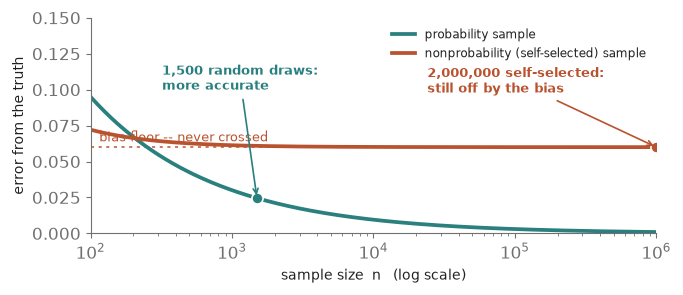
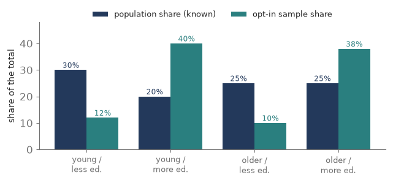
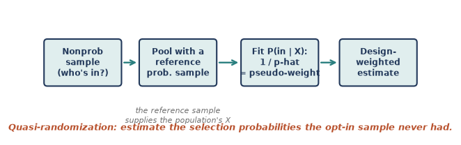
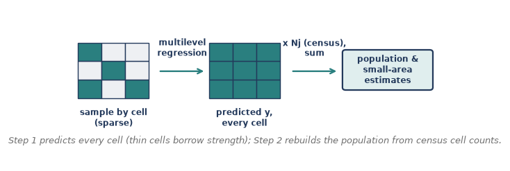
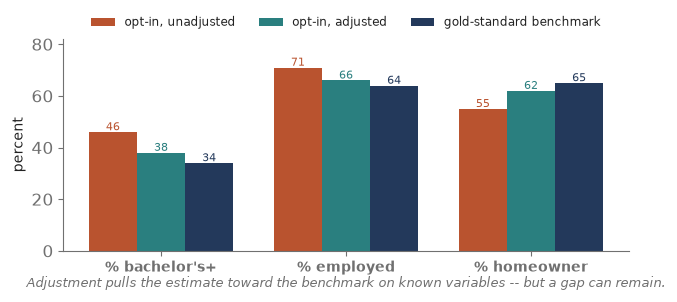

Everything in Modules 0 through 8 rests on one foundation: a **probability sample**, where every unit has a known, nonzero chance of selection. That known random mechanism is what buys design weights, near-unbiased estimates, and honest standard errors. But a great deal of modern data has no such mechanism — opt-in web panels, social-media streams, customer lists, convenience and 'river' samples. Nobody drew them with a lottery; people **selected themselves.** Module 9 asks the uncomfortable question: when a probability sample is not feasible, can we still say something valid about the population? The answer is a careful 'sometimes, if...' — and this module is about the **if**. Six pieces of concept, then a hands-on seventh in R.

## Piece 1 — What breaks without probability sampling

Strip away the known selection mechanism and the whole machine from Modules 1-8 stops turning.

- **No selection probabilities, no design weights.** The estimator loses its built-in guarantee of pointing at the population value — there is no 1/pi to expand the sample back to the whole.
- **The real danger is selection bias.** Self-selection is usually correlated with what we measure: politically engaged people answer political polls; healthy people join health apps. The sample tilts, and the estimate tilts with it.
- **Big n does not save you.** With a probability sample, error shrinks like 1/sqrt(n) toward zero. With a biased sample, error shrinks toward a **bias floor** it can never cross. A bigger biased sample is just a more precise wrong answer — the **big-data paradox**: a tiny random sample can beat a massive self-selected one.

In Total Survey Error terms, you have traded a controllable **sampling** error for a much harder-to-see **selection / coverage** bias. That trade is the whole subject of this module.

{fig-align="center"}

::: {.fieldnote}
**Check yourself (Piece 1).** An opt-in panel has 2 million respondents; a probability survey has 1,500. Which do you trust more for a population estimate, and what single fact decides it?
:::

## Piece 2 — When can you fix it? (the ignorability idea)

Nonprobability samples are not hopeless — but the rescue rests on a strong, **untestable** assumption.

- **The condition (ignorable selection).** A cousin of 'missing at random': once you condition on a set of covariates X, being in the sample is unrelated to the outcome y. Within each X-cell, the responders look like the population.
- **You need rich covariates X** that drive both *who selects in* and *the outcome.* Age and sex alone rarely suffice.
- **You need a benchmark** — the population distribution of X, from a census or a gold-standard survey — so you know what to correct toward.
- **The fundamental limit.** If selection depends on something you did not measure (and cannot proxy), no method fixes it. That is why nonprobability inference is always an **argument**, never a guarantee.

Given ignorability, two strategies follow, attacking from opposite ends: model **who is in the sample** (pseudo-weights, Piece 3) or model **the outcome itself** (MRP, Piece 4).

{fig-align="center"}

::: {.fieldnote}
**Check yourself (Piece 2).** You adjust an opt-in health survey for age and sex, but sicker people are likelier to join *even within* age-sex groups. Is selection ignorable here, and what happens to your adjusted estimate?
:::

## Piece 3 — Quasi-randomization and pseudo-weights (model the selection)

The first strategy pretends the nonprobability sample was a probability sample all along — with selection probabilities we simply have to **estimate.**

- **The quasi-randomization idea.** Treat 'being in the opt-in sample' as an outcome to model.
- **The recipe.** Stack your nonprobability sample with a **reference probability sample** (or the population). Fit a model — usually logistic regression — predicting membership in the nonprobability sample from covariates X. The fitted values are estimated **inclusion propensities**.
- **The pseudo-weight** is 1 / (estimated propensity) — exactly the base-weight logic of Module 6: rarely-selected profiles stand for many. From there you analyze with the design-based weighting machinery you already know.
- **A simpler cousin: calibration / raking** (Module 6 again). Skip the propensity model and just rake the sample to known population totals on X. Easier, but it only corrects the margins you rake on.

**Cautions.** The weights are *estimated*, so standard errors must account for that (replication, Module 7); extreme pseudo-weights inflate variance (deff\_w) and often get trimmed; and everything hinges on X capturing what drives selection.

{fig-align="center"}

::: {.fieldnote}
**Check yourself (Piece 3).** Pseudo-weighting needs a second data source the raw opt-in sample doesn't contain. What is it, and what job does it do?
:::

## Piece 4 — MRP: multilevel regression with poststratification (model the outcome)

The second strategy ignores selection probabilities entirely and instead models **what people say**, then rebuilds the population from a census. **MRP** does this in two steps.

- **Step 1 — multilevel regression.** Predict the outcome y from covariate cells (age x region x education, ...) using a **multilevel / random-effects** model, so small, sparsely sampled cells **borrow strength** from the overall pattern instead of being trusted on their three respondents. You get a stable predicted y for **every** cell in the grid.
- **Step 2 — poststratification.** Weight each cell's predicted y by that cell's **known share of the population** (from a census poststratification table) and add them up. The population's composition, not the sample's, drives the total.

**Why it is powerful.** It excels at **small-area estimation** — credible state-by-state opinion from a single national sample — and it stays robust when cells are thin. It famously produced accurate state-level election forecasts from a wildly unrepresentative sample of Xbox gamers.

**Requires:** a poststratification frame (population counts for every cell) and covariates that genuinely predict y.

**Pseudo-weights vs. MRP:** one models **who is in**; the other models **what they'd say**. They are complementary — and modern **doubly robust** methods combine both, giving you two chances to be right.

{fig-align="center"}

::: {.fieldnote}
**Check yourself (Piece 4).** In MRP, where does the population actually enter — the regression step or the poststratification step — and why does that placement matter?
:::

## Piece 5 — Assessing the bias (how do you know it worked?)

Here is the humbling part. A probability sample certifies its own precision from the design. A nonprobability estimate cannot — you have to **build a case** that the residual bias is small.

- **Benchmark against knowns.** Compare your adjusted estimates to gold-standard external figures (census, big federal surveys) on variables you *do* know. If it misses on the knowns, distrust it on the unknowns.
- **Sensitivity analysis.** Re-estimate under different covariate sets and models. If the answer swings, it is fragile; if it holds, you have more confidence.
- **Covariate balance.** Check that, after weighting, the sample's X-distribution actually matches the population's.
- **Variance from the weights.** Estimated pseudo-weights inflate variance (deff\_w and n\_eff from Modules 6-7); a large effective-sample-size loss is its own warning.
- **State the assumption out loud.** Name the ignorability assumption plainly: 'we assume selection is unrelated to y given these covariates.' It is untestable, so disclosing it is part of the deliverable.

{fig-align="center"}

::: {.fieldnote}
**Interview anchor (Pew).** This is home turf for the roles you are targeting. Pew Research Center runs its **American Trends Panel** as a **probability-based** online panel — recruited by national random sampling of addresses — precisely to sidestep the self-selection problem in this module. And Pew's own published evaluations of **online opt-in** samples found that weighting *narrowed* the gap to known benchmarks but did **not** close it, with residual bias uneven across subgroups — a real-world version of this piece. Expect to be asked how you would judge whether an opt-in sample is fit for purpose.
:::

::: {.fieldnote}
**Check yourself (Piece 5).** Your adjusted opt-in estimate matches the census on age, sex, and education, but you never measured political interest. What can benchmarking tell you here, and what can it never tell you?
:::

## Piece 6 — Choosing an approach

No method conjures a probability sample out of thin air; you pick the tool that best fits your **covariates**, your **benchmark**, and your **target**.

| **Approach** | **Models...** | **Needs** | **Shines when...** |
|---|---|---|---|
| Probability sample | nothing (design does it) | frame + fieldwork | you can afford the gold standard |
| Pseudo-weights | who is in the sample | reference prob. sample + X | you have a good reference sample |
| MRP | the outcome y | census frame + predictive X | small areas, thin cells |
| Calibration / raking | the margins only | known population totals | a quick, transparent fix |

**Rule of thumb.** A rich reference sample points to **pseudo-weights**; a strong census frame and small-area targets point to **MRP**; when you have both, **combine** them (doubly robust). Whatever you choose, **benchmark** the result — that is the non-negotiable step.

::: {.fieldnote}
**Check yourself (Piece 6).** You want state-level estimates from a national opt-in sample and you have census cell counts. Which approach is the natural fit, and why?
:::

## Piece 7 — Doing it in R

No single package 'does nonprobability sampling'; you assemble a few. Here is the shape of each workflow — pseudo-weights, MRP, and a balance check.

::: {.fieldnote}
**Read-along, not run.** R is not yet installed on your machine, so treat this piece as a reference — every line is ready to run the moment we set R up.
:::

**1. Pseudo-weights (quasi-randomization, Piece 3).** Pool the opt-in sample with a reference probability sample, model membership, invert the propensity.

::: {.fieldnote}
pooled \<- rbind(nonprob, refsamp) \# stack opt-in (inNP=1) + reference (inNP=0)
m \<- glm(inNP ~ age + educ + region, family = binomial,
~~~~~~~~~data = pooled, weights = ref\_wt)
phat \<- predict(m, nonprob, type = "response") \# inclusion propensity
nonprob$psw \<- 1 / phat \# pseudo-weight = 1 / p-hat
des \<- svydesign(ids = ~1, weights = ~psw, data = nonprob)
svymean(~y, des)
:::

Or a modern one-call package that also gives doubly robust options:

::: {.fieldnote}
library(nonprobsvy)
nonprob(selection = ~ age + educ + region, \# model who's in
~~~~~~~~target = ~ y, data = nonprob, svydesign = ref\_design)
:::

**2. MRP (Piece 4).** A multilevel model, then poststratify predictions to census cell counts.

::: {.fieldnote}
library(lme4)
fit \<- glmer(y ~ (1\|state) + (1\|age) + (1\|educ) + repvote, \# step 1: partial pooling
~~~~~~~~~~~~~data = samp, family = binomial)
post$pred \<- predict(fit, post, type = "response", \# predict every census cell
~~~~~~~~~~~~~~~~~~~~allow.new.levels = TRUE)
est \<- with(post, sum(pred \* Nj) / sum(Nj)) \# step 2: poststratify to N\_j
:::

(For thin cells, the Bayesian version — brms::brm or rstanarm::stan\_glmer — behaves better.)

**3. Check covariate balance (Piece 5).**

::: {.fieldnote}
library(cobalt)
bal.tab(inNP ~ age + educ + region, data = pooled, weights = "psw")
:::

**Each concept, and the R that does it**

| **Concept (piece)** | **R** |
|---|---|
| Pseudo-weights (P3) | glm() + svydesign() , or nonprobsvy::nonprob() |
| Calibration / raking (P3) | survey::calibrate() / rake() |
| Multilevel regression (P4) | lme4::glmer() , or brms / rstanarm (Bayesian) |
| Poststratification (P4) | sum(pred \* Nj) / sum(Nj) over census cells |
| Balance / bias check (P5) | cobalt::bal.tab() |

::: {.fieldnote}
**Check yourself (Piece 7).** In the MRP code, what does allow.new.levels = TRUE let the model do, and why is that the whole point of the multilevel step?
:::

## Coursework anchor (625 / 745)

Nonprobability inference is the frontier of the Survey & Data Science world — the material that appears the moment a client cannot afford a full probability sample but still wants a population number. It leans on every earlier module at once: weighting (6), design-based variance (7), and the honest accounting of bias versus variance (0). It is also the methodological heart of the applied roles you are targeting, where opt-in panels, voter files, and modeled audiences are everyday inputs. The hands-on layer — fitting the propensity and multilevel models in R — is the next time we open it.

## Interview angles

- **Can you trust an opt-in online poll?** Only under an ignorability assumption — selection unrelated to the outcome given measured covariates — plus good covariates and a benchmark. Big n doesn't help; it just makes the bias precise (the big-data paradox).
- **Pseudo-weights vs. MRP?** Pseudo-weights model selection (propensity of being in the sample, via a reference probability sample); MRP models the outcome and poststratifies to census cells. Complementary — combine for double robustness.
- **What is MRP, and when would you use it?** Multilevel regression + poststratification: it partial-pools sparse cells and rebuilds the population from a census — ideal for small-area estimates from a nonrepresentative sample.
- **How do you validate a nonprobability estimate?** Benchmark against known external totals, run sensitivity analyses, check covariate balance and the effective sample size, and state the untestable selection assumption plainly.
- **Why can't weighting fully fix an opt-in sample?** Weighting can only correct imbalance on variables you measured and have population totals for; selection on unobserved factors is untouched.
- **When is nonprobability defensible?** When probability sampling is infeasible or too costly, you have rich covariates and a solid benchmark, and the stakes tolerate an assumption-based estimate — with the assumptions disclosed.

## Quick check

1. In one sentence, why doesn't a huge sample size rescue a self-selected sample?
2. Name the untestable assumption that all nonprobability adjustment relies on.
3. Pseudo-weighting: what second data source do you need, and what do you model with it?
4. MRP has two steps — name them, and say which one uses the census.
5. Give two ways to build evidence that a nonprobability estimate's residual bias is small.

## Module 9 in one breath

- Nonprobability samples have no known selection mechanism, so self-selection breeds selection bias — and big n only makes the bias precise (the big-data paradox).
- Adjustment is possible only under **ignorability**: selection unrelated to y given measured covariates X, plus a population benchmark for X.
- **Pseudo-weights** (quasi-randomization) model who's in the sample — 1 / estimated propensity, via a reference probability sample — then reuse design-based weighting.
- **MRP** models the outcome with a multilevel regression, then poststratifies predicted cell values to census counts; great for small areas and thin cells.
- You can never certify a nonprobability estimate from the design — **benchmark** it, test its sensitivity, check balance, and state the assumption out loud.
