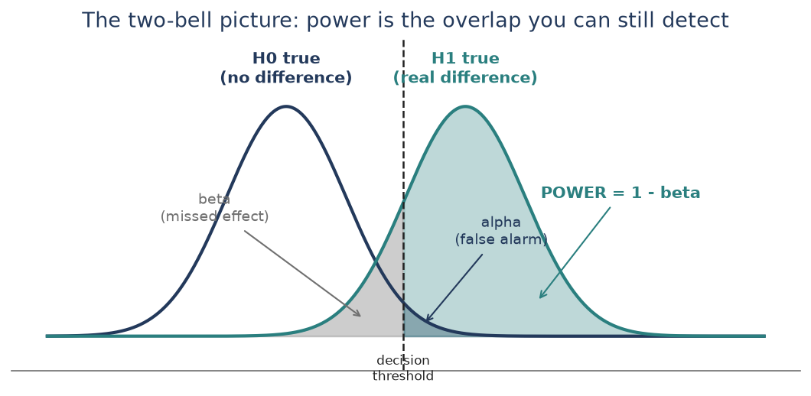
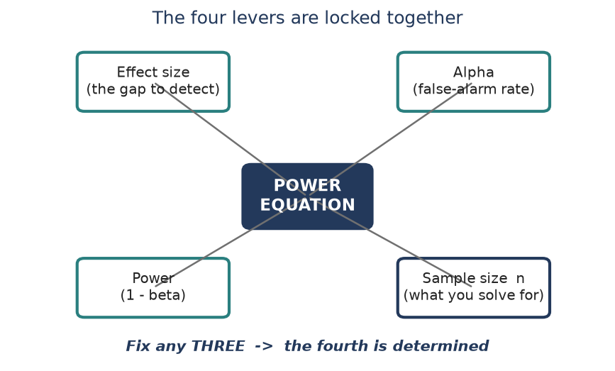
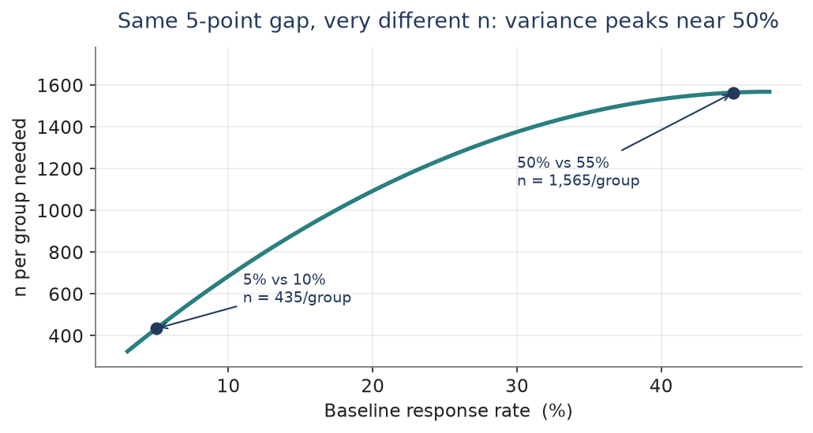
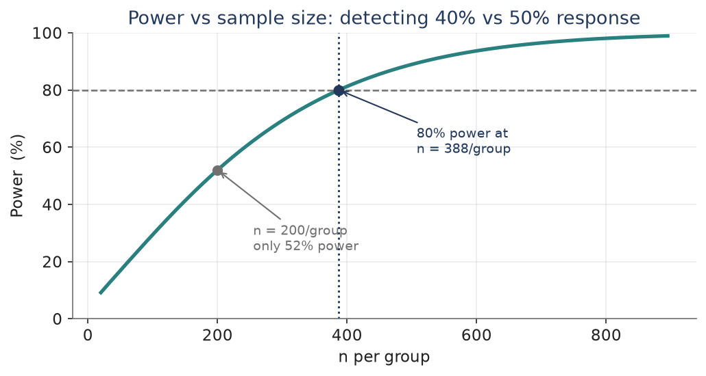
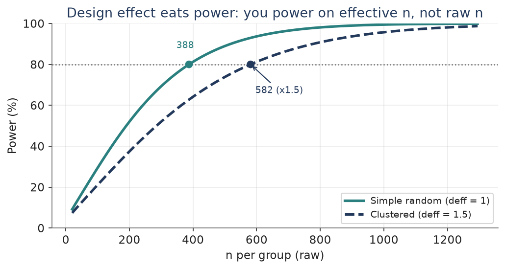
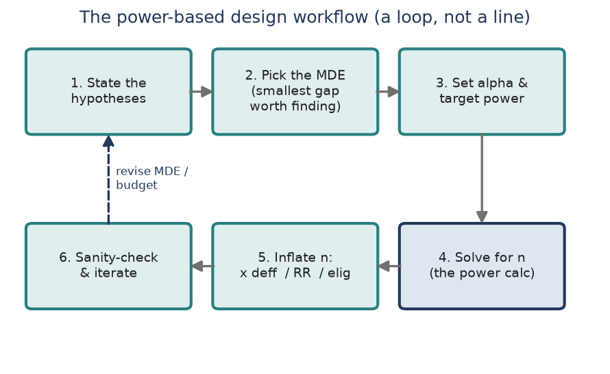

Modules 0 through 9 taught you to **draw** a sample and **analyze** it honestly. This bonus module answers the question a study team asks **before** any of that: **how many people do we actually need?** That is a **power calculation**, and running it to get n is exactly what **determining a sample size** means. We anchor it to your **AAMC internship** task - comparing **two response rates** across invitation conditions - the calc you were handed but never got to fully learn. It is a cousin of Module 1"s "sample size for a target precision," but here the target is a **difference to detect**, not a margin of error. 6 pieces of concept, then a hands-on seventh in R.

## Piece 1 — What power actually means

Every comparison is a bet against being fooled. When you test whether two response rates differ, two things can go wrong. You can **cry wolf** - declare a difference that is not real (**Type I error**, rate **alpha**). Or you can **miss a real difference** that is sitting right in front of you (**Type II error**, rate **beta**). **Power** is the good outcome on that second axis: **power = 1 - beta**, the probability you **catch** a real difference when one truly exists.

- **Alpha** (Type I): the false-alarm rate you set in advance - usually 0.05. It is the risk you accept of seeing an effect that is not there.
- **Beta** (Type II): the miss rate. You do not set it directly; it falls out of your design once you fix effect size, alpha, and n.
- **Power = 1 - beta**: your detection rate. Convention is **80%** (sometimes 90%) - an 80%-powered study catches a real effect 4 times out of 5, and misses it 1 time out of 5.

{fig-align="center"}

The picture is the whole idea. Two sampling distributions of your test statistic: one if there is **no** difference (navy), one if there **is** (teal). They **overlap**. Wherever you put the decision threshold, you trade one error for the other - push it right to shrink alpha and you grow beta. The only way to shrink **both** tails at once is to **pull the bells apart** or **make them skinnier**, which is exactly what a bigger effect or a bigger sample does. That is what the next piece unpacks.

**The 2 x 2 of being right and wrong**

|  | **Decision: no difference** | **Decision: difference** |
|---|---|---|
| Truth: no difference | Correct (1 - alpha) | Type I error (alpha) |
| Truth: real difference | Type II error (beta) | Correct = POWER (1 - beta) |

::: {.fieldnote}
**Check yourself.** In plain words, what is the difference between **alpha** and **beta** - and which one does "power" come from?
:::

## Piece 2 — The four levers

A power calculation is **one equation** tying together four quantities. Fix any **three** and the fourth is pinned down. That is the entire mental model - every power tool you will ever touch is just this equation solved for whichever slot you left blank.

- **Effect size** - the gap you want to catch (here, the difference between two response rates). **Bigger gap → easier → less n.**
- **Alpha** - your false-alarm tolerance. **Smaller alpha (stricter) → harder → more n.**
- **Power** - the detection rate you demand. **Higher power → more n.**
- **Sample size n** - usually **the unknown you solve for**. Determining a sample size = running this equation with n as the blank.

{fig-align="center"}

Two directions of the **same** equation matter in practice. Leave **power** blank and you get the **diagnostic** question - "given the n I can afford, what power do I have?" Leave **n** blank and you get **sample-size determination** - "to hit 80% power, how many do I need?" It is the second one that a study team hands you, and the one Piece 4 works end to end.

**Which way each lever pushes the sample size**

| **Lever** | **Turn it...** | **...and n moves** |
|---|---|---|
| Effect size (gap) | bigger | down (easier) |
| Alpha | smaller / stricter | up |
| Power (1 - beta) | higher (80 → 90%) | up |
| Variability of outcome | larger | up |

::: {.fieldnote}
**Check yourself.** If your budget shrinks and you can only afford half the sample, which of the other three levers must you relax - and what does that cost you?
:::

## Piece 3 — Effect size for two proportions

Effect size is where people stumble, because for proportions it is **not just the gap** - the **baseline rate matters too**. A proportion"s variability is **p(1 - p)**, which is **largest at 50%** and shrinks toward 0% or 100%. So the **same** absolute gap is **hardest to detect (needs the most n) near 50%**, and easier out in the tails.

- Define the **minimum detectable effect (MDE)**: the **smallest** difference worth finding. You do not power for the gap you hope for - you power for the smallest gap that would still matter. Smaller MDE → much larger n (n grows like 1 / gap-squared).
- Detecting **50% vs 55%** (a 5-point gap at the worst-case variance) needs **~1,565 per group**. The **same** 5-point gap at **5% vs 10%** needs only **~435 per group** - 3-4x fewer, because variance is far smaller down there.
- **Cohen"s h** is the standardized version for two proportions: h = \|2·arcsinsqrtp2 - 2·arcsinsqrtp1\|. For 40% vs 50%, h ~ 0.20 (a "small" effect by Cohen"s 0.2 / 0.5 / 0.8 rule of thumb). It lets a tool talk about "effect size" without you re-specifying the two rates.

{fig-align="center"}

The takeaway for the AAMC setting: **state the MDE first** - the smallest response-rate improvement that would change a decision - and know that a modest baseline near 40-50% is the **expensive** zone. That single choice drives almost everything about the n you will report.

**Same-looking gaps, very different sample sizes**

| **Comparison** | **Gap** | **Variance zone** | **n / group (80% power)** |
|---|---|---|---|
| 5% vs 10% | 5 pts | small (tail) | ~434 |
| 40% vs 50% | 10 pts | near max | ~388 |
| 50% vs 55% | 5 pts | maximum | ~1,565 |

::: {.fieldnote}
**Check yourself.** Two designs both aim to detect a 5-point difference. One is around 10%, the other around 50%. Which needs the bigger sample, and why?
:::

## Piece 4 — The AAMC calc, worked both ways

Now the real task: at AAMC you compared **response rates across invitation conditions**. Suppose condition A runs at a **40%** response rate and you want to detect an improvement to **50%** under condition B - a 10-point MDE - at **alpha = 0.05** two-sided and **80% power**. The two-proportion sample-size formula (per group, equal n) is:

n = ( z\[a/2\] \* sqrt(2 p\_bar q\_bar) + z\[b\] \* sqrt(p1 q1 + p2 q2) )^2 / (p1 - p2)^2

- Plug in: z\[a/2\] = 1.96, z\[b\] = 0.84, p\_bar = 0.45, and (p1 - p2) = 0.10.
- Numerator = (1.96 x 0.704 + 0.84 x 0.700)^2 = (1.379 + 0.588)^2 = 3.87. Denominator = 0.10^2 = 0.01. So 3.87 / 0.01 = 387.3.
- Always round a sample size **up**: **n = 388 per group, about 776 total.** That is your sample-size determination - the number you would hand the study team.

{fig-align="center"}

Run the **same** equation the **other** direction to sanity-check a budget. If you could only field **200 per group**, plug n in and solve for power instead: you would land at just **~52%** power - more likely to miss the effect than catch it. That is why the calc is worth doing **before** fielding, not after: 200/group feels substantial but is badly underpowered for a 10-point gap.

**One equation, three ways to point it**

| **You fix...** | **You solve for...** | **Result** | **Reading** |
|---|---|---|---|
| MDE, alpha, power | n | ~388 / group | sample-size determination |
| MDE, alpha, n = 200 | power | ~52% | budget diagnostic |
| MDE, alpha, n = 100 | power | ~29% | clearly underpowered |

::: {.fieldnote}
**Interview anchor (AAMC)**
"At AAMC I compared response rates across invitation conditions. To size the study I ran a two-proportion power calc - set the MDE at the smallest response-rate gap worth acting on, held alpha at 0.05 and power at 80%, and solved for n per arm. I also checked the reverse: what power our feasible n actually bought, so we knew going in whether we were powered to see the effect." That sentence turns the task you were handed into something you can now **explain and defend**.
:::

::: {.fieldnote}
**Check yourself.** You solved for n at 80% power and got ~388/group. Without redoing the arithmetic, will demanding **90%** power make that number go up or down?
:::

## Piece 5 — What eats your power (the sampling tie-in)

The textbook formula assumes a clean, simple random sample with everyone responding. Real designs are messier, and each wrinkle **eats power** - meaning you need **more** raw n to keep the same detection rate. This is where the whole course comes back.

- **Design effect (deff).** Clustering and unequal weights inflate variance by deff (Modules 4, 6, 7). You do not power on raw n - you power on **effective n = n / deff**. To keep 80% power under deff = 1.5, multiply your clean n by 1.5: ~388/group becomes ~582/group.
- **Nonresponse.** Power depends on **completed** interviews, not invitations. If only 62% respond, divide the required completes by 0.62 to get the **release** count (Module 8"s inflation step). Your AAMC response-rate work is exactly this lever.
- **One- vs two-sided.** A one-sided test spends all alpha on one tail and needs slightly less n - but only use it when the direction is genuinely fixed in advance. Defaulting to two-sided is the safe, expected choice.
- **Multiple comparisons.** Testing many invite conditions at once inflates the family-wise false-alarm rate; a Bonferroni-style smaller alpha per test protects it but **costs power**, so each test needs more n.

{fig-align="center"}

This piece is what makes it **your** module rather than a generic stats chapter: a defensible field sample size is the clean power-calc n, then **inflated for deff, nonresponse, and eligibility** - the same chain you built in Module 8, now driven by a detection target instead of a margin of error.

::: {.fieldnote}
**Check yourself.** Your power calc says you need 400 completes per group. The design has deff = 1.4 and you expect a 60% response rate. Roughly how many people must you **release** per group?
:::

## Piece 6 — The planning workflow

Putting it together, sizing a comparison study is a short, repeatable **loop**. It is a loop and not a line because the first n you get is often unaffordable - so you revise the MDE or the budget and go around again.

- **1. State the hypotheses.** What two rates, which direction, one- or two-sided.
- **2. Pick the MDE.** The smallest gap worth detecting - the single most consequential choice.
- **3. Set alpha and target power.** Usually 0.05 and 80% (or 90%).
- **4. Solve for n.** The power calc of Piece 4 - this is the sample-size determination.
- **5. Inflate n.** Multiply by deff, divide by response rate, divide by eligibility → a real release count.
- **6. Sanity-check and iterate.** Affordable? Reasonable MDE? If not, revise and loop.

{fig-align="center"}

::: {.fieldnote}
**In one breath.** *Power is your chance of catching a real difference; a power calc is one equation linking effect size, alpha, power, and n; leave n blank and you have determined your sample size; then inflate that n for design effect, nonresponse, and eligibility to get the number you actually field.*
:::

## Piece 7 — Doing it in R (read-along reference)

**R is not installed on this machine yet, so treat this piece as read-along, not run.** When you do have R, two base calls and the **pwr** package cover almost everything above. Here is the AAMC calc in code.

::: {.fieldnote}
\# — — base R: two-proportion sample size, solve for n — — 
power.prop.test(p1 = 0.40, p2 = 0.50,
 sig.level = 0.05, power = 0.80)
\# → n = 387.3 (round up to 388) per group (two-sided by default)

\# reverse direction: fix n, solve for power
power.prop.test(p1 = 0.40, p2 = 0.50, n = 200)
\# → power ~ 0.52

\# — — pwr package: effect-size (Cohen"s h) interface — — 
install.packages("pwr"); library(pwr)
h \<- ES.h(0.50, 0.40) \# standardized effect size
pwr.2p.test(h = h, sig.level = 0.05, power = 0.80)

\# unequal group sizes (e.g. more in one invite arm)
pwr.2p2n.test(h = h, n1 = 300, n2 = 500, sig.level = 0.05)

\# — — inflate the clean n for a real field release — — 
n\_clean \<- 388
deff \<- 1.5 ; rr \<- 0.62 ; elig \<- 0.90
release \<- ceiling(n\_clean \* deff / rr / elig)
release \# people to invite per arm

\# — — when no formula fits: simulate — — 
sim\_power \<- function(n, p1, p2, reps = 5000) {
 hit \<- replicate(reps, {
 a \<- rbinom(1, n, p1); b \<- rbinom(1, n, p2)
 prop.test(c(a, b), c(n, n))$p.value \< 0.05 })
 mean(hit) }
sim\_power(388, 0.40, 0.50) \# ~ 0.80
:::

**Concept → R call**

| **You want...** | **R call** |
|---|---|
| n for a two-proportion test | power.prop.test(p1, p2, power=) |
| power given n | power.prop.test(p1, p2, n=) |
| effect-size (Cohen"s h) interface | pwr.2p.test() / ES.h() |
| unequal group sizes | pwr.2p2n.test() |
| anything with no clean formula | simulate with rbinom + prop.test |

::: {.fieldnote}
**Check yourself.** Which single R function gives you **both** the sample-size answer and the power answer, just by changing which argument you leave out?
:::

## Quick check — the whole module in five questions

- 1. Define power in one sentence, using the word **beta**.
- 2. Name the four levers a power calc ties together. Which one do you usually solve for?
- 3. Why does a 5-point gap near 50% need more sample than a 5-point gap near 10%?
- 4. Your clean power calc says 388/group. Deff is 1.5 and response is 62%. Roughly what release count do you report?
- 5. In R, which function did the AAMC two-proportion calc, and how do you flip it from "solve for n" to "solve for power"?
